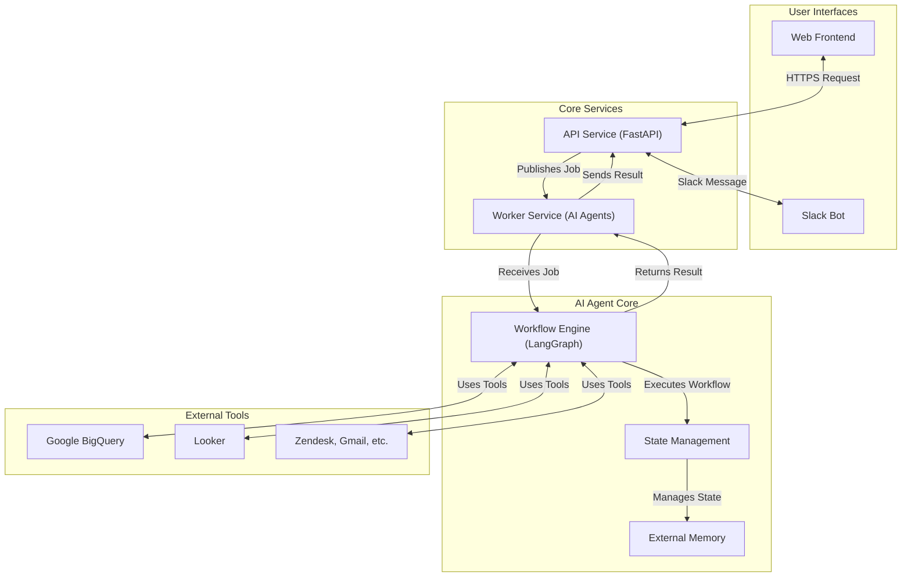

# Thrasio IQ Fullstack

## 1. Introduction

Thrasio IQ is an advanced, enterprise-grade AI platform designed to automate complex data analysis and business workflows. It functions as a multi-agent system that integrates seamlessly with a variety of internal and external data sources, providing actionable insights and streamlining operations through a conversational interface available via a web application and Slack.

The platform is built on a robust microservices architecture, ensuring scalability, maintainability, and resilience. It leverages powerful AI agents to understand user queries, interact with data services like Google BigQuery and Looker, and deliver precise results, from simple data retrieval to complex, multi-step analytical reports.

## 2. Core Features

- **Multi-Agent AI System**: Utilizes specialized AI agents for different tasks, such as data analysis, query building, and workflow execution.
- **Extensive Data Integration**: Natively connects to critical business and data platforms including Google BigQuery, Looker, Zendesk, Gmail, Monday, gmail and NetSuite. 
- **Conversational Interfaces**: Users can interact with the system through an intuitive web-based chat interface or directly from Slack.
- **Workflow Automation**: Leverages LangGraph to define and execute complex, stateful workflows, enabling sophisticated data processing and decision-making chains.
- **Scalable and Resilient Architecture**: Built with a microservices pattern, containerized with Docker, and managed with Terraform for robust, production-grade deployments.
- **Comprehensive Monitoring**: Integrated with Prometheus and Grafana for real-time monitoring and alerting.
- **Shared Data Models**: A dedicated `shared` library ensures consistency for data schemas and models across all services.

## 3. Core Workflow

The system processes user requests through a well-defined workflow, starting from the user interface and extending to the data sources.



**Workflow Steps:**
1.  A user submits a query through the **Web Frontend** or **Slack Bot**.
2.  The request is received by the **API Service**.
3.  The API service validates the request and publishes a job to the **Worker Service**.
4.  The Worker Service's **Workflow Engine** (powered by LangGraph) initiates a new analysis task.
5.  The assigned AI agent breaks down the query, manages its **State**, and leverages **Tools** to connect to data sources like **BigQuery** or **Looker**.
6.  Data is retrieved and analyzed within the workflow.
7.  The final result is passed back through the services and delivered to the user on the originating interface.

## 4. Tech Stack

| Category              | Technology                                       |
| --------------------- | ------------------------------------------------ |
| **Backend**           | Python, FastAPI, LangGraph                       |
| **Frontend**          | React / Next.js, TypeScript                      |
| **AI & Data**         | Google Cloud AI Platform, Google BigQuery, Looker|
| **Infrastructure**    | Docker, Terraform, Google Cloud Platform (GCP)   |
| **Monitoring**        | Prometheus, Grafana                              |
| **Database**          | PostgreSQL (inferred)                            |
| **Communication**     | RESTful APIs, Pub/Sub Messaging                  |


## 5. Directory Structure

```
/
├───docs/                 # Project documentation, architecture, and research
├───infrastructure/       # Terraform and Docker configurations for deployment
│   ├───docker/
│   └───terraform/
├───monitoring/           # Prometheus and Grafana setup for monitoring
├───scripts/              # Utility scripts for deployment, migration, etc.
├───services/             # Core microservices
│   ├───api/              # Main RESTful API service (FastAPI)
│   ├───frontend/         # Web user interface (React/Next.js)
│   ├───slack-bot/        # Slack integration service
│   └───worker/           # AI agent and workflow processing service
├───shared/               # Shared libraries (models, schemas) for services
└───README.md             # This file
```
