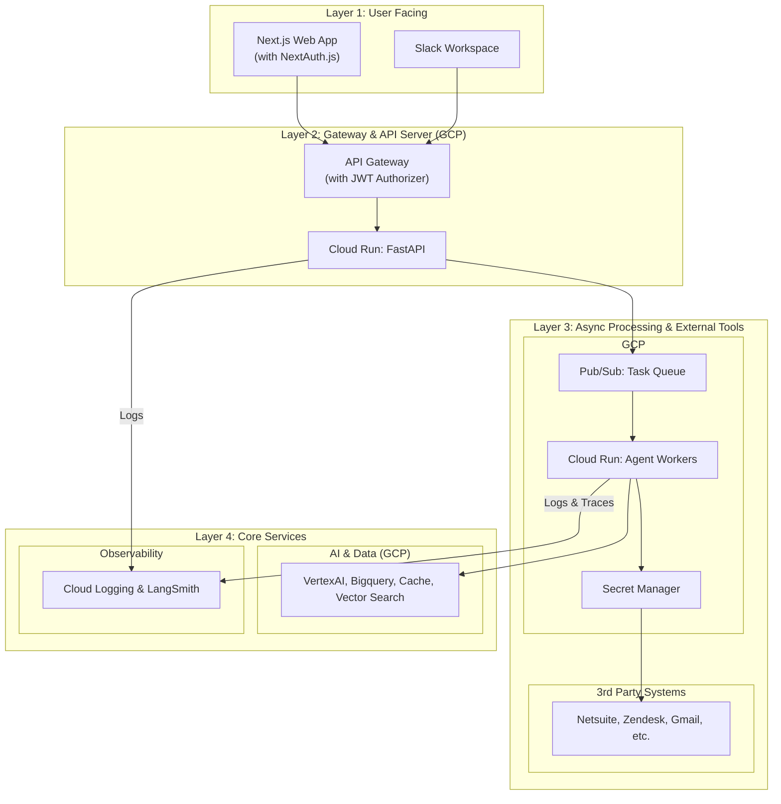
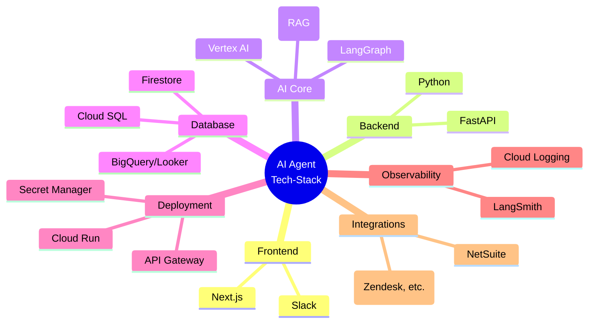

# 企业级多 Agent 系统深度调研报告

## 摘要

本报告旨在深入探讨如何构建和部署一个企业级的多 Agent AI 系统。除了业界熟知的 LangChain/LangGraph 框架外，我们还将探索与之配套的核心技术栈、在 Google Cloud Platform (GCP) 上的经典部署方案，并通过架构图展示各组件间的协同工作方式。

---

## 1. 核心框架与库：超越 LangChain/LangGraph

构建一个强大的企业级多 Agent 系统，需要一个完整的生态系统支持。LangChain/LangGraph 提供了核心的编排能力，但还需要以下关键组件：

### 1.1  Agent 任务编排

- **LangChain**
- **LangGraph**

### 1.2 云平台与 MLOps

- **Google Vertex AI**: GCP 的一站式 AI 平台。它不仅提供对 Gemini 等先进模型的访问，还推出了 **Reasoning Engine**，一个专门用于部署、扩展和监控 AI Agent 的托管服务。

### 1.3 数据处理与验证

- **PydanticAI**: 在企业级应用中，数据的准确性和一致性至关重要。PydanticAI 利用 Pydantic 的强大能力，对流入和流出 AI Agent 的数据进行严格的结构定义和验证，是系统稳定性的重要保障。

### 1.4 可视化与工作流编排

- **LangFlow**: 一个为 LangChain 设计的可视化界面，用户可以通过拖拽组件的方式构建和测试 Agent 工作流，大大降低了原型设计的门槛。

---

## 2. GCP 经典部署方案

在 GCP 上部署多 Agent 系统，最经典和推荐的方案是围绕 **Vertex AI** 构建一个无服务器（Serverless）的、可扩展的架构。

### 前端与集成

#### Web 前端框架

为了最大化开发效率和利用成熟的生态，推荐使用 **Next.js** 作为前端框架。

- **为什么选择 Next.js**:
  - **成熟与流行**: Next.js 是业界领先的 React 框架，拥有庞大的社区和丰富的学习资源。
  - **功能完备**: 它内置了服务端渲染 (SSR)、文件系统路由、API 路由、图片优化等大量功能，极大减少了重复性开发工作。
  - **UI 组件库**: 可以与 `shadcn/ui`、`Material-UI` 等成熟的 UI 组件库无缝集成，快速构建专业的用户界面。
  - **轻松部署**: Next.js 应用可以方便地打包成 Docker 容器部署到 **Cloud Run**，或直接托管在 Vercel 平台上。

#### 用户身份认证 (Google OAuth)

为了确保系统的安全性，并为个性化功能提供支持，需要集成可靠的用户身份认证体系。

- **实现方式**:
  1.  **前端 (Next.js)**: 使用业界标准的 `NextAuth.js` (Auth.js) 库，并配置其 **Google Provider**。这会为您的 Web App 提供“使用 Google 登录”的功能，并处理所有与 Google OAuth 2.0 相关的复杂流程。
  2.  **Token 传递**: 用户成功登录后，`NextAuth.js` 会在前端维护一个安全的会话。当 Web App 调用后端 API 时，它会在请求的 `Authorization` 头中自动附带一个 **JWT (JSON Web Token)**。
  3.  **后端 (API Gateway)**: 在 API Gateway 上配置一个 **JWT 授权方 (Authorizer)**。此授权方负责在请求到达您的后端服务之前，对每个请求头中的 JWT 进行验证（检查签名、有效期、签发者等）。
  4.  **服务访问**: 只有通过 JWT 验证的请求才会被允许访问后端的 Cloud Run 服务。未通过验证的请求会直接被网关以 `401 Unauthorized` 错误拒绝，从而保护了后端服务的安全。FastAPI 服务则可以从受信任的 JWT 中解析出用户 ID，用于后续的业务逻辑。

#### Slack 集成

将 Agent 集成到 Slack 中是典型的企业级应用场景，可以让员工在日常工作中无缝使用 AI 能力。

- **实现方式**:
  1.  创建一个 **Slack Bot**，它本质上是一个监听 Slack 事件的后端服务。
  2.  这个服务可以部署为一个独立的 **Cloud Run** 实例，或在主 FastAPI 服务中增加一个专门的端点（如 `/slack/events`）。
  3.  当用户在 Slack 中@机器人时，Slack 会向该端点发送一个事件。
  4.  服务接收事件，提取用户输入，然后通过 HTTP 请求调用核心的 LangGraph Agent 服务。
  5.  Agent 执行完毕后，服务通过 Slack API 将结果发回对应的频道。
  6.  LangChain 社区提供的 `langchain-community` 等工具包可以简化与 Slack SDK 的集成。

#### 对接外部企业系统 (Tool Usage)

AI Agent 最大的价值之一是作为“智能胶水”，连接和自动化企业现有的各种 SaaS 和内部系统。

- **实现方式：将 API 调用封装为 Agent 工具**
  1.  **创建自定义工具**: 对于需要对接的每个外部系统（如 Netsuite, Zendesk, Gmail, Monday 等），通过调用其官方 API 来创建相应的 Python 函数，例如 `create_zendesk_ticket()`。
  2.  **安全管理凭证**: 所有 API Key 或 OAuth 凭证都应通过 **GCP Secret Manager** 进行安全地存储和调用，严禁硬编码。
  3.  **封装为 LangChain Tool**: 将上述 Python 函数封装为 LangChain 的 `Tool` 对象。关键是为每个 `Tool` 编写一个清晰、准确的**描述 (description)**，这是指导 LLM 何时以及如何使用该工具的核心。
  4.  **Agent 使用工具**: 在创建 LangGraph Agent 时，将这些工具提供给它。当用户发出指令时，Agent 会根据指令意图，自动选择最合适的工具并生成所需参数来执行。
- **在架构中的位置**: 这些工具的调用逻辑通常属于耗时操作，因此它们应该在**异步的 Agent Worker** 中执行。

### 2.1 核心计算服务与 Web 框架

而是将 Agent 逻辑封装在一个 Web 框架中，以 API 的形式对外提供服务。FastAPI 在这里扮演着至关重要的 **API 服务器** 角色。

- **FastAPI 的作用**:

  - **API 封装**: 它们将 LangGraph 构建的 Agent 核心逻辑封装成标准的 HTTP API 端点（例如 `/chat`）。这使得任何前端应用（Web, Mobile）或其他后端服务都可以通过简单的 HTTP 请求来调用和驱动 Agent。
  - **请求处理**: 负责接收传入的请求，解析参数（如用户输入），调用相应的 Agent 工作流，并将 Agent 的执行结果格式化为 JSON 等格式返回。
  - **推荐选择**: **FastAPI** 是首选，因为它基于现代 Python 类型提示，性能高，并能自动生成交互式 API 文档 (Swagger UI)，极大地方便了开发和调试。

- **Cloud Run**: 这是部署 **FastAPI 应用** 的首选。您将 FastAPI 应用和 Agent 逻辑一同打包成 Docker 容器进行部署。Cloud Run 负责处理所有网络流量、安全性和自动伸缩（甚至缩容到零），完美匹配 Agent 系统可能存在的间歇性、高并发的工作负载，极具成本效益。

- **Cloud Functions**: 用于处理更轻量级、事件驱动的任务。例如，当一个新文件上传到 Cloud Storage 时，可以触发一个 Cloud Function 来进行预处理，然后通过 HTTP 请求调用部署在 Cloud Run 上的 FastAPI Agent 服务。

### 2.2 数据与状态管理

- **Firestore**: 一个可扩展的 NoSQL 数据库，非常适合存储 Agent 的对话历史、中间状态和会话数据。其灵活的数据模型可以轻松适应多 Agent 交互中产生的复杂数据结构。
- **Cloud SQL (for PostgreSQL/MySQL)**: 当 Agent 需要更结构化的、支持事务的长期记忆时，Cloud SQL 是一个可靠的选择。
- **Vector Search (on Vertex AI or Firestore)**: 实现 RAG 的关键。无论是使用 Vertex AI 内置的 Vector Search，还是利用 Firestore 的向量搜索扩展，都能为 Agent 提供强大的外部知识库检索能力。

### 2.3 可观测性：日志与追踪

对于任何生产级系统，强大的日志记录和链路追踪能力都是不可或缺的，它们是系统监控、故障排查和性能优化的基石。

- **应用与业务日志 (Google Cloud Logging)**:

  - **适用范围**: 覆盖所有常规的业务逻辑日志，包括用户登录、API 调用、Agent 使用情况、系统错误等。
  - **实现方式**: GCP 的各项服务（Cloud Run, API Gateway 等）都已**原生集成** Cloud Logging。您在 FastAPI 应用中通过标准 `logging` 库打印的日志（推荐使用 **JSON 结构化日志**）会被自动收集。
  - **价值**: 提供了集中的日志存储、强大的查询分析能力，并可以基于日志模式创建**告警 (Alerting)**。

- **AI 链路追踪 (LangSmith)**:
  - **适用范围**: 这是专门为调试和监控 LLM 应用而设计的、不可替代的工具。
  - **实现方式**: 只需在 Agent Worker 服务的环境变量中配置好 LangSmith 的 API Key，LangGraph 就会自动捕获并上报每一次执行的完整轨迹。
  - **价值**: 您可以清晰地看到 LangGraph 中每一步的状态变化、LLM 的输入与输出、工具的调用与返回，当 Agent 行为不符合预期时，能够快速定位问题根源。

### 2.5 架构图示

下图清晰地展示了上述所有组件（包括中间件）如何协同工作，构成一个完整的、健壮的企业级多 Agent 系统部署方案。

**流程解析 (含中间件):**

1.  **用户登录**: 用户在 **Next.js Web App** 中通过 **NextAuth.js** 完成 Google 账号登录。
2.  **API 请求与验证**:
    - Web App 发出的每个 API 请求都会携带 JWT。
    - **API Gateway** 的 **JWT Authorizer** 会验证此 JWT。只有合法的请求才会被转发到后端。
    - 来自 **Slack** 的事件请求则通过另一种方式（如签名验证）进行认证。
3.  **请求处理 (FastAPI)**: 后端服务接收到经过验证的请求，并根据请求来源（Web 或 Slack）和内容进行处理。
4.  **同步 vs 异步处理**:
    - **对于快速任务**: FastAPI 直接调用 Agent 逻辑，与 **Vertex AI**, **Firestore**, **Memorystore (Redis)**, **Cloud SQL** 等交互，然后同步返回结果。
    - **对于耗时任务**: FastAPI 将任务信息发送到 **Cloud Pub/Sub** 队列，并立即返回一个任务 ID 给用户。
5.  **Agent 工作者 (Worker)**: 一个或多个独立的 Cloud Run 服务（或 GKE Pod）作为工作者，监听 **Cloud Pub/Sub** 队列。一旦有新任务，便取出并执行。
6.  **后台执行**: 工作者服务在后台执行完整的 Agent 逻辑。这包括：
    - 与 **Vertex AI** 和内部数据服务（Firestore, SQL, etc.）进行核心推理和记忆交互。
    - 从 **Secret Manager** 获取凭证，通过调用外部 API 的方式执行**工具（Tools）**，与 **Netsuite, Zendesk** 等外部系统交互。
7.  **结果通知**: 任务完成后，工作者通过 **WebSocket** 或直接调用 **Slack API** 等方式，将最终结果或状态更新推送给用户。

---

---

## 3. 工程化最佳实践：保障企业级部署质量

虽然强大的技术栈是基础，但要确保多 Agent 系统在企业环境中的长期稳定、高效和可维护，还必须引入一系列成熟的工程化最佳实践。

### 3.1 基础设施即代码 (Infrastructure as Code, IaC)

在复杂的云环境中，手动配置和管理资源（如 Cloud Run, API Gateway, Firestore 等）容易出错且难以追踪。IaC 是解决此问题的关键。

- **核心工具**: **Terraform** 是业界标准，它允许您用声明式的配置文件（HCL 语言）来定义所有 GCP 资源。
- **核心价值**:
    - **自动化与可重复性**: 一键创建或销毁整套环境，确保开发、测试、生产环境的绝对一致。
    - **版本控制**: 将基础设施配置像应用代码一样纳入 Git 管理，实现变更追踪、代码审查和回滚。
    - **减少人为错误**: 消除手动操作带来的风险。

### 3.2 持续集成与持续部署 (CI/CD)

CI/CD 是现代软件开发的基石，对于 Agent 系统同样至关重要。

- **核心工具**: **GitHub Actions** 或 **Google Cloud Build**。
- **典型流水线 (Pipeline)**:
    1.  **触发**: 开发者向 Git 仓库提交代码 (`git push`)。
    2.  **持续集成 (CI)**:
        - 自动运行代码风格检查 (Linter)。
        - 自动运行单元测试和集成测试 (`pytest`)。
        - 构建 Docker 镜像。
    3.  **持续部署 (CD)**:
        - 将新的 Docker 镜像推送到 **Artifact Registry**。
        - 自动将新镜像版本部署到 **Cloud Run** 的测试环境。
        - (可选) 在通过测试后，需要人工审批或自动部署到生产环境。
- **核心价值**: 加快迭代速度，提高部署频率，并确保每次部署都经过了自动化测试的验证。

### 3.3 全面的测试策略

企业级应用必须有严格的测试来保障其可靠性。

- **单元测试 (Unit Tests)**:
    - **工具**: `pytest`
    - **目标**: 针对单个函数或小模块（如一个 Tool 的实现）进行测试，验证其逻辑的正确性，不依赖外部服务。
- **集成测试 (Integration Tests)**:
    - **工具**: `pytest`
    - **目标**: 测试多个组件协同工作的正确性，例如测试 FastAPI 端点能否正确调用 LangGraph 流程并与模拟的数据库交互。
- **端到端测试 (E2E Tests)**:
    - **工具**: **Cypress** 或 **Playwright**
    - **目标**: 从用户视角出发，模拟真实的用户操作（如在 Next.js 界面上点击按钮、输入文本），验证整个系统的完整流程，包括前端、后端 API、Agent 执行和结果展示。

### 3.4 实时流式响应 (Real-time Streaming)

对于对话式 Agent，用户期望能像与真人聊天一样，看到文字逐字或逐句地生成，而不是等待很长时间后一次性看到完整答案。

- **实现方式**:
    - **Server-Sent Events (SSE)**: 这是实现流式响应的轻量级首选方案。FastAPI 对 SSE 提供了出色的原生支持。后端可以在 Agent 生成 token 或中间步骤结果时，持续地向前端推送事件。
    - **WebSockets**: 对于需要双向通信的复杂场景（例如 Agent 需要主动向前端询问问题），WebSocket 是更强大的选择。
- **核心价值**: 极大地提升用户交互体验，降低用户在等待过程中的焦虑感。

---

## 4. 结论

构建一个企业级的多 Agent 系统是一个系统工程。

- 在 **框架层面**，对于需要高可靠性的企业级应用，**LangGraph** 以其确定性的有状态图（Stateful Graph）提供了最稳定和可控的流程编排。结合 **LlamaIndex** 构建强大的知识库、**PydanticAI** 保证数据质量以及将**外部 API 调用封装为工具**，是构建企业级 Agent 的黄金组合。
- 在 **部署层面**，GCP 提供了一套以 Vertex AI 为核心、以 Cloud Run 为计算引擎、以 Firestore/Cloud SQL 为数据存储的黄金组合，能够以高性价比的方式构建一个稳定、可扩展的生产级系统。同时，必须集成 **Cloud Logging** 和 **LangSmith**，以建立完整的可观测性体系，确保系统的长期健康运行。

---

## 附录 A：技术栈总结

本附录旨在通过列表和图表的形式，归纳总结构建本报告所述的企业级多 Agent 系统所涉及到的核心技术栈。

### 技术栈列表

-   **前端 (Frontend)**
    -   **框架**: Next.js
    -   **UI 组件库**: shadcn/ui, Material-UI (MUI), Ant Design
    -   **认证**: NextAuth.js (Auth.js)

-   **后端 (Backend)**
    -   **语言**: Python
    -   **Web 框架**: FastAPI

-   **AI 核心 (AI Core)**
    -   **编排框架**: LangGraph
    -   **数据索引 (RAG)**: LlamaIndex
    -   **模型服务**: Google Vertex AI
    -   **数据校验**: PydanticAI

-   **数据存储与分析 (Database & Analytics)**
    -   **状态/短期记忆 (NoSQL)**: Google Firestore
    -   **长期记忆 (SQL)**: Google Cloud SQL
    -   **向量数据库**: Vertex AI Vector Search
    -   **数据仓库 (DWH)**: Google BigQuery
    -   **商业智能 (BI)**: Google Looker

-   **部署与托管 (Deployment & Hosting)**
    -   **网关**: Google API Gateway (with JWT Authorizer)
    -   **计算服务**: Google Cloud Run
    -   **凭证管理**: Google Secret Manager

-   **可观测性 (Observability)**
    -   **应用/业务日志**: Google Cloud Logging
    -   **AI 链路追踪**: LangSmith

-   **外部集成 (Integrations)**
    -   **通信**: Slack
    -   **企业系统 (SaaS)**: Netsuite, Zendesk, Gmail, Monday.com, etc.

### 技术栈图 (Mermaid Mindmap)

