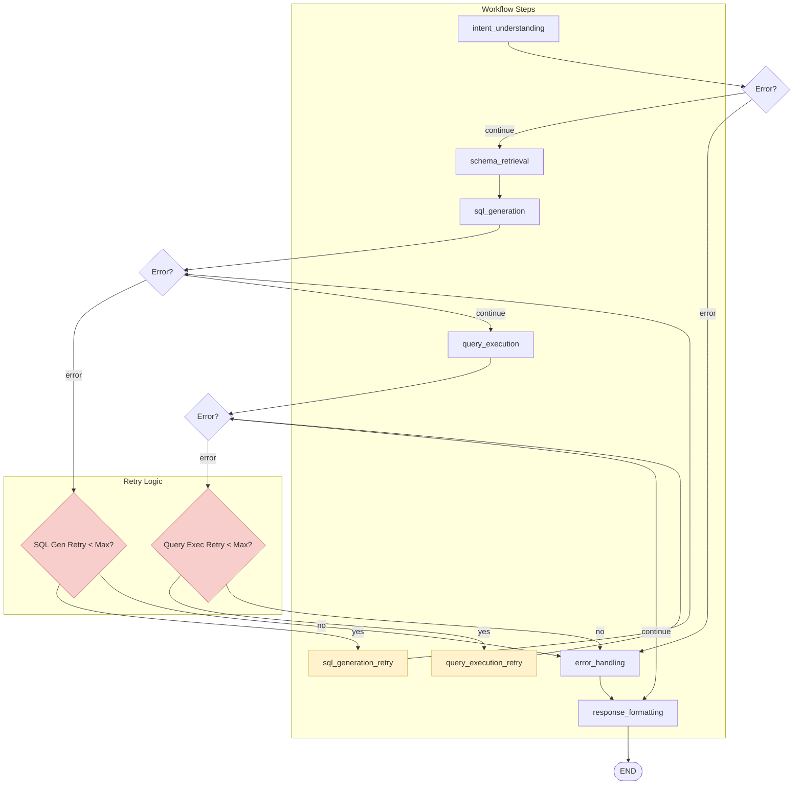
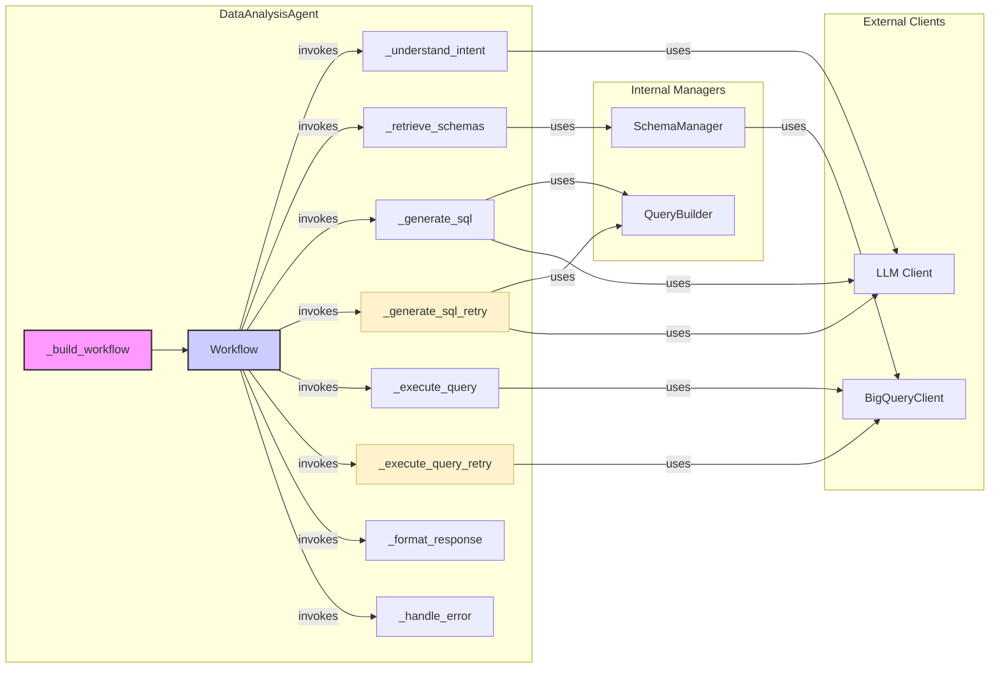

## table分析

1. welcome信息: 表格显示所有dataset
2. 接受用户所选择的dataset. (后续再做前端按钮交互)
3. 表格显示这个dataset下的所有tables(后续再做悬浮table后显示这个table的scheme), 并询问用户输入分析任务
4. 意图分析, 保证安全, 仅可读,  (如果用户意图是分析tables的具体数据)
5. 读取数据库scheme
6. query生成
7. query数据小规模测试, 最大返回前 10 条数据(自测试和自验证, 用户不可见)
8. 汇总执行所有query, 收集所有结果 (Token 检查器含Bigquery和LLM成本分析, SQL正则构建器)(如触发最大Token, 将临时结果先进行分析后存储到外部记忆)
9. 为用户呈现智能分析结果

## scheme 解释

1. welcome信息: 表格显示所有dataset
2. 接受用户所选择的dataset. (后续再做前端按钮交互)
3. 表格显示这个dataset下的所有tables(后续再做悬浮table后显示这个table的scheme), 并询问用户输入分析任务
4. 意图分析, 保证安全, 仅可读, (如果用户意图是分析tables的scheme)
5. 读取数据库scheme
6. 持续交互scheme分析结果

## Looker BI 构建

1. welcome信息: 表格显示所有dataset
2. 接受用户所选择的dataset. (后续再做前端按钮交互)
3. 表格显示这个dataset下的所有tables(后续再做悬浮table后显示这个table的scheme), 并询问用户输入分析任务
4. 意图分析, 保证安全, 仅可读,  (如果用户意图是使用tables的数据去构建Looker)

# 旧版 DataAnalysisAgent 详解

本文档详细解释 `DataAnalysisAgent` 的功能、内部逻辑、接口、输入输出以及其组件间的调用关系。

## 1. 核心功能

`DataAnalysisAgent` 是一个基于 `LangGraph` 构建的数据分析智能体。其核心功能是接收用户的自然语言查询，并自动执行一系列步骤来完成数据分析任务，最终返回结构化的结果，甚至生成数据可视化图表。

主要任务包括：
- **意图理解**: 解析用户查询，识别其分析意图（如查询数据、生成可视化等）。
- **数据模式检索**: 根据用户意图，从 BigQuery 中查找相关的表结构（Schema）。
- **SQL 生成**: 基于用户意图和相关的表结构，自动生成 SQL 查询语句。
- **查询执行**: 在 BigQuery 上执行生成的 SQL 语句。
- **结果格式化**: 将分析结果和错误信息整合成对用户友好的响应。

## 2. 工作流程 (Workflow)

该智能体的工作流程被定义为一个状态图 (StateGraph)，其中每个节点代表一个处理步骤。

### 步骤详解:
1.  **`intent_understanding`**: 理解用户查询的意图。
2.  **`schema_retrieval`**: 根据意图检索相关的 BigQuery 表结构。
3.  **`sql_generation`**: 生成 SQL 查询。
4.  **`sql_generation_retry`**: SQL 生成失败时的重试逻辑，包含重试计数器检查。
5.  **`query_execution`**: 执行 SQL 并获取结果。
6.  **`query_execution_retry`**: 查询执行失败时的重试逻辑，包含重试计数器检查。
7.  **`response_formatting`**: 格式化最终的响应。
8.  **`error_handling`**: 捕获并处理工作流程中任何步骤的错误。

### 重试机制:
- **SQL 生成重试**: 当 SQL 生成失败时，检查重试次数是否小于最大重试次数（默认2次），如果是则重新尝试生成 SQL。
- **查询执行重试**: 当查询执行失败时，检查重试次数是否小于最大重试次数（默认2次），如果是则重新尝试执行查询。
- **重试计数器**: 每个重试步骤都维护独立的计数器，避免无限重试。
- **最终错误处理**: 如果重试次数达到上限，将错误传递给统一的错误处理节点。

## 3. 核心类与接口

### `DataAnalysisAgent`
这是主类，负责初始化和编排整个工作流程。

- **`__init__(self, bigquery_client, llm_client, project_id)`**: 构造函数。
  - **`bigquery_client`**: `BigQueryClient` 实例，用于与 BigQuery 交互。
  - **`llm_client`**: 大语言模型客户端，用于意图理解和 SQL 生成。
  - **`project_id`**: Google Cloud 项目 ID。

- **`_build_workflow(self)`**: 构建 LangGraph 工作流程。

- **`async def _understand_intent(self, state)`**: 节点方法，理解用户意图。
- **`async def _retrieve_schemas(self, state)`**: 节点方法，检索表结构。
- **`async def _generate_sql(self, state)`**: 节点方法，生成 SQL。
- **`async def _generate_sql_retry(self, state)`**: 节点方法，SQL 生成重试逻辑，包含重试计数器管理。
- **`async def _execute_query(self, state)`**: 节点方法，执行查询。
- **`async def _execute_query_retry(self, state)`**: 节点方法，查询执行重试逻辑，包含重试计数器管理。
- **`async def _format_response(self, state)`**: 节点方法，格式化响应。
- **`async def _handle_error(self, state)`**: 节点方法，处理错误。
- **`def _should_retry_sql_generation(self, state)`**: 辅助方法，检查是否应该重试 SQL 生成。
- **`def _should_retry_query_execution(self, state)`**: 辅助方法，检查是否应该重试查询执行。

### `AnalysisState` (TypedDict)
这个类定义了工作流程中传递的状态。它包含了所有步骤的输入和输出。

- **输入**:
  - `user_query: str`
  - `user_id: str`
  - `session_id: str`
- **中间状态/输出**:
  - `intent: Optional[AnalysisIntent]`
  - `relevant_schemas: List[Dict[str, Any]]`
  - `generated_sql: Optional[str]`
  - `query_results: Optional[Dict[str, Any]]`
  - `final_response: Optional[str]`
  - `execution_error: Optional[str]`
- **重试控制**:
  - `sql_generation_retry_count: int`: SQL 生成重试次数计数器（默认0）
  - `query_execution_retry_count: int`: 查询执行重试次数计数器（默认0）
  - `max_retries: int`: 最大重试次数（默认2，可通过配置调整）

### `AnalysisIntent` (Pydantic Model)
这个数据类用于结构化地表示从用户查询中理解到的意图。

- `intent_type: str`: 意图类型 (e.g., "query", "visualization")
- `entities: List[str]`: 提及的实体 (表、字段)
- `metrics: List[str]`: 指标
- `dimensions: List[str]`: 维度
- `filters: Dict[str, Any]`: 过滤条件

## 4. 组件调用关系

`DataAnalysisAgent` 依赖多个外部客户端和内部管理器来完成其工作。

### 调用关系详解:
- **`DataAnalysisAgent`** 是核心协调者，负责构建和管理整个工作流程。
- **重试节点** (`_generate_sql_retry`, `_execute_query_retry`) 提供容错机制，在关键步骤失败时自动重试。
- **外部客户端** 提供与 LLM 和 BigQuery 的接口能力。
- **内部管理器** 封装了业务逻辑，如 Schema 管理和 SQL 构建。
- **重试逻辑** 通过状态中的计数器控制，避免无限重试，提高系统稳定性。
- **`_understand_intent`** 和 **`_generate_sql`** 节点会调用 **LLM Client** 来处理自然语言和生成代码。
- **`_retrieve_schemas`** 节点使用 **`SchemaManager`**，而 `SchemaManager` 内部调用 **`BigQueryClient`** 来获取元数据。
- **`_execute_query`** 节点直接使用 **`BigQueryClient`** 来运行查询。
- **`QueryBuilder`** 是一个辅助工具，用于以编程方式构建 SQL 语句，主要在 **`_generate_sql`** 中使用。