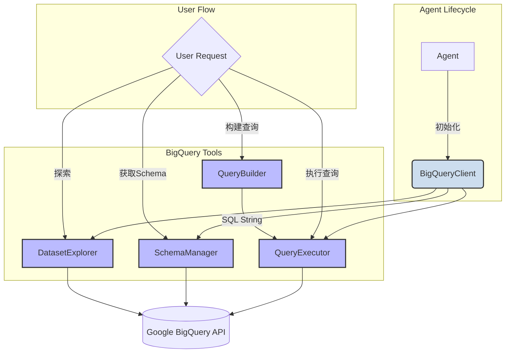

## 项目概述

本执行计划基于 `/Users/KC/KCodes/thrasio_iq_backend/docs/development/agent1.md` 文档，旨在逐步实现 BigQuery x Looker 数据分析 Agent。该 Agent 是 Thrasio IQ 企业级多 Agent 系统的核心组件，专门负责处理数据查询、分析和可视化任务。
该文档专注阐述于BigQuery&Langgraph的功能

### tasks list
- [ ] 查阅Bigquery官方文档, 看看是否有更好的交互机制, 定义更多的工具
- [ ] 是否需要管理环境变量?
- [ ] 工具的定义是否符合LangGraph的tool规范?
- [ ] query工具必须只能READ, 不能做其他操作
- [ ] 超出边界预警, 超出边界时使用脚本生成器缩减大小

## 现有工具

### 工具关系分析与Mermaid图

下面是重构后 `bigquery` 工具包中各个模块的依赖关系和调用流程分析, 以及一个Mermaid流程图来可视化这些关系。

#### 关系分析:

1.  **`BigQueryClient` (`client.py`)**: 这是所有操作的核心与底层封装, 直接与 `google-cloud-bigquery` 库交互。它统一提供了执行查询、获取Schema、列出数据集/表等同步方法。所有上层工具都依赖于该客户端的单一实例, 避免了重复的认证和配置。

2.  **`SchemaManager` (`schema_manager.py`)**: 该模块依赖于 `BigQueryClient`。它通过接收一个 `BigQueryClient` 实例来获取和管理表的元数据, 并提供了缓存功能, 提高了元数据访问效率。

3.  **`DatasetExplorer` (`dataset_explorer.py`)**: 该模块同样依赖于 `BigQueryClient`。它作为一个高级工具, 用于探索数据集和表, 其所有操作都通过注入的 `BigQueryClient` 实例完成。

4.  **`QueryExecutor` (`query_executor.py`)**: 该模块也依赖于 `BigQueryClient`。它负责执行SQL查询, 并通过共享的 `BigQueryClient` 实例与 BigQuery 通信。

5.  **`QueryBuilder` (`query_builder.py`)**: 这是一个独立的、无状态的SQL查询构建器。它不依赖任何其他模块, 仅用于通过链式调用的方式安全地构建SQL查询字符串。

#### 调用流程:

一个典型的Agent调用流程如下:
1.  Agent初始化时, 创建一个 `BigQueryClient` 的单例。
2.  将此 `BigQueryClient` 实例注入到 `DatasetExplorer`, `SchemaManager`, 和 `QueryExecutor` 中。
3.  使用 `DatasetExplorer` 探索可用的数据集和表。
4.  使用 `SchemaManager` 获取特定表的详细Schema。
5.  基于用户的请求, 使用 `QueryBuilder` 构建一个SQL查询。
6.  将构建好的查询传递给 `QueryExecutor` 来执行, 并获取最终的数据结果。

#### Mermaid图:

### 1. BigQueryClient (`client.py`)

- **功能**: 统一的、同步的BigQuery客户端底层封装。它是所有其他工具与Google BigQuery服务通信的唯一入口,负责处理认证和核心API调用。
- **主要方法**:
  - `__init__(self, project_id: str, credentials_path: str)`: 初始化客户端。
  - `execute_query(self, query: str) -> Iterator[Dict]`: 执行SQL查询。
  - `get_dataset_info(self, dataset_id: str) -> Dict`: 获取数据集的元数据。
  - `get_table_info(self, table_id: str) -> Dict`: 获取表的元数据和Schema。
  - `list_datasets(self) -> List[str]`: 列出所有数据集。
  - `list_tables(self, dataset_id: str) -> List[str]`: 列出指定数据集中的所有表。

### 2. SchemaManager (`schema_manager.py`)

- **功能**: 管理和缓存BigQuery表的Schema信息。它通过注入的`BigQueryClient`实例获取数据,并提供同步方法供上层调用。
- **主要方法**:
  - `__init__(self, client: BigQueryClient)`: 接收一个`BigQueryClient`实例进行初始化。
  - `get_table_schema(self, table_id: str) -> TableSchema`: 同步获取并缓存表的Schema。
  - `get_dataset_schemas(self, dataset_id: str) -> List[TableSchema]`: 同步获取并缓存数据集中所有表的Schema。

### 3. DatasetExplorer (`dataset_explorer.py`)

- **功能**: 作为高级工具,用于探索BigQuery的数据集和表。所有操作都通过注入的`BigQueryClient`实例完成,不再独立管理客户端连接。
- **主要方法**:
  - `__init__(self, client: BigQueryClient)`: 接收一个`BigQueryClient`实例进行初始化。
  - `list_datasets(self) -> List[str]`: 列出所有数据集。
  - `list_tables(self, dataset_id: str) -> List[str]`: 列出指定数据集中的表。
  - `get_table_detail(self, table_id: str) -> Dict`: 获取表的详细信息。

### 4. QueryExecutor (`query_executor.py`)

- **功能**: 负责执行SQL查询。它接收一个`BigQueryClient`实例,并使用它来运行查询和处理结果。
- **主要方法**:
  - `__init__(self, client: BigQueryClient)`: 接收一个`BigQueryClient`实例进行初始化。
  - `run(self, query: str, max_results: int = 1000) -> Dict`: 执行查询并返回结构化的结果。

### 5. QueryBuilder (`query_builder.py`)

- **功能**: 一个独立的、安全的SQL查询构建器,通过链式调用来构建查询,有效防止SQL注入。
- **主要方法**:
  - `select(self, *columns) -> 'QueryBuilder'`: 添加`SELECT`子句。
  - `from_(self, table) -> 'QueryBuilder'`: 添加`FROM`子句。
  - `where(self, condition) -> 'QueryBuilder'`: 添加`WHERE`子句。
  - `build(self) -> str`: 构建并返回最终的SQL查询字符串。

## 工具建议
目前已经有工具, 但可以考虑增加以下工具来完善Agent的能力:

1.  **查询验证与优化工具 (QueryValidationTool)**:
    *   **功能**: 在执行查询前,使用BigQuery的`dry_run`功能验证查询的有效性,并估算查询将处理的数据量和成本。可以向用户提供成本预警。
    *   **价值**: 避免无效查询,控制成本。

2.  **智能图表生成工具 (ChartGeneratorTool)**:
    *   **功能**: 根据查询结果自动推荐并生成合适的图表类型(如折线图、柱状图、饼图)。可以将查询结果(DataFrame)转换为图表的可视化配置(如ECharts, Plotly的JSON配置)。
    *   **价值**: 将数据分析结果直接可视化,提升交互体验。

3.  **数据质量检查工具 (DataQualityCheckTool)**:
    *   **功能**: 对指定表的关键字段进行数据质量检查,如检查空值比例、唯一值数量、数据分布等,并生成一份数据质量报告。
    *   **价值**: 帮助用户快速了解数据质量,发现数据问题。

4.  **BigQuery ML 推理工具 (BQMLInferenceTool)**:
    *   **功能**: 利用 BigQuery ML 的 `ML.PREDICT` 功能，让 AI可以直接调用已经训练好的机器学习模型进行推理。例如，可以对新数据进行分类、预测、聚类等。AI 只需要提供模型名称和输入数据即可。
    *   **价值**: 极大地增强了 AI 的分析能力，使其不仅仅是查询数据，还能利用复杂的模型进行智能预测和分析，而无需将数据移出 BigQuery。

5.  **地理空间分析工具 (GeospatialAnalysisTool)**:
    *   **功能**: 封装 BigQuery 的地理空间函数 (如 `ST_DISTANCE`, `ST_CONTAINS`, `ST_GEOHASH`)。AI 可以提出“查找A点附近5公里内的所有门店”或“计算区域B内的用户密度”等自然语言问题，该工具将其转换为对应的地理空间查询。
    *   **价值**: 赋予 AI 处理和理解地理位置数据的能力，适用于物流、零售、城市规划等多种场景。

6.  **全文检索与非结构化数据查询工具 (SearchTool)**:
    *   **功能**: 利用 BigQuery 的 `SEARCH` 函数，对非结构化文本或半结构化 JSON 数据进行高效检索。AI 可以执行“在用户评论中搜索包含‘电池续航差’的记录”这类模糊查询。
    *   **价值**: 让 AI 能够从海量的文本数据中快速提取有价值的信息，适用于知识库问答、日志分析、用户反馈处理等。

7.  **数据血缘与依赖分析工具 (DataLineageTool)**:
    *   **功能**: 解析 BigQuery 的审计日志或利用第三方数据治理工具的 API，来追踪特定表或视图的数据来源和下游依赖。AI 可以回答“这个报表的数据来自哪些原始表？”或“修改这个表会影响哪些下游应用？”。
    *   **价值**: 提高数据处理流程的透明度和可维护性，帮助 AI 理解数据之间的复杂关系，在进行数据操作或分析时更加安全可靠。

8.  **时间序列分析工具 (TimeSeriesAnalysisTool)**:
    *   **功能**: 封装 BigQuery 的时间序列分析函数（如 `ML.FORECAST`），让 AI 能够对时间序列数据进行趋势预测、异常检测等。例如，AI 可以查询“预测下个季度的销售额”或“检测过去24小时内有无异常的用户登录行为”。
    *   **价值**: 赋予 AI 预测未来的能力，对于商业智能、运营监控等领域至关重要。

9.  **向量/语义搜索工具 (VectorSearchTool)**:
    *   **功能**: 利用 BigQuery 的 `VECTOR_SEARCH` 函数和与 Vertex AI 嵌入模型的集成。AI 可以执行基于语义的相似性搜索，例如“查找描述与‘耐用轻便的徒步背包’相似的产品”，而不仅仅是关键词匹配。
    *   **价值**: 在非结构化文本上实现复杂的、基于含义的搜索，极大地提高了复杂查询结果的相关性，是构建智能问答、推荐系统的关键。

10. **权限感知与检查工具 (AccessCheckTool)**:
    *   **功能**: 在执行查询之前，此工具会检查 AI 自身对目标表和列的访问权限。它可以识别任何因列级安全或动态数据遮盖而无法访问的列。
    *   **价值**: 使 AI 更加健壮和透明。AI 不会因“权限被拒绝”的通用错误而失败，而是可以主动通知用户：“我无法访问 `user_email` 列，因为它受到保护”，并建议可行的替代查询。

11. **物化视图顾问工具 (MViewAdvisorTool)**:
    *   **功能**: 列出与用户查询相关的可用物化视图。它可以分析一个查询，并建议是否可以通过重写查询来利用现有的物化视图，从而显著提高性能并降低成本。
    *   **价值**: 赋予 AI 扮演性能调优助理的角色，通过利用预计算结果来优化查询，而无需创建新视图的写入权限。

12. **BI引擎性能报告工具 (BIEngineReporterTool)**:
    *   **功能**: 查询执行后，此工具可以检索统计信息，以报告查询是否由 BigQuery BI 引擎加速。它可以提供有关加速模式和性能增益的详细信息。
    *   **价值**: 让 AI 能够洞察其查询的性能特征，使其能够了解哪种类型的查询最适合内存加速，并向用户提供更全面的性能报告。

13. **预测可解释性工具 (ExplainPredictionTool)**:
    *   **功能**: 封装 `ML.EXPLAIN_PREDICT` 函数。当 AI 使用 BQML 模型进行预测后，可以调用此工具来获取预测结果的可解释性。它能返回每个特征对预测结果的贡献度。
    *   **价值**: 让 AI 不仅能“知其然”，还能“知其所以然”。AI 可以向用户解释为什么会做出某个特定的预测（例如，“我们预测该用户会流失，主要是因为他的近期购买频率下降了70%”），极大地提升了分析结果的可信度和深度。

14. **智能推荐工具 (RecommenderTool)**:
    *   **功能**: 封装 `ML.RECOMMEND` 函数。AI 可以直接为某个用户或物品请求推荐列表，例如“为用户ID 123 推荐5个商品”或“查找与商品ID XYZ 最相似的商品”。
    *   **价值**: 将强大的协同过滤推荐引擎能力赋予 AI，使其能够轻松地在对话中提供个性化推荐，是电商、内容平台等场景的杀手级应用。

15. **高级数据剖析工具 (DataProfilerTool)**:
    *   **功能**: 对指定的表或查询结果进行全面的数据剖析。它能自动计算关键指标，如数值列的分布（均值、方差、分位数）、类别列的最常见值和频率、空值和零值的百分比，并以结构化格式返回。
    *   **价值**: 在 AI 开始复杂分析之前，为其提供对数据分布、偏斜、异常值和潜在质量问题的深刻理解。这使得 AI 能够编写出更高效、更准确的查询，并能主动发现数据洞察。

16. **历史数据快照查询工具 (ChangeHistoryTool)**:
    *   **功能**: 利用 BigQuery 的 `FOR SYSTEM_TIME AS OF` 子句，查询表在过去某个特定时间点的状态。AI 可以回答“这个客户上周的会员等级是什么？”或“对比一下这个产品本月和上月的库存变化”。
    *   **价值**: 赋予 AI “时间旅行”的能力，能够轻松地进行历史数据对比和趋势分析，而无需管理复杂的数据快照表。

17. **异常检测工具 (AnomalyDetectionTool)**:
    *   **功能**: 封装 `ML.DETECT_ANOMALIES` 函数。AI 可以直接对时间序列数据请求异常点检测，例如“检查过去一个月网站的每日访问量是否存在异常？”。
    *   **价值**: 自动化地发现数据中的“意外”事件，帮助 AI 主动识别潜在问题或机会，例如系统故障、欺诈活动或病毒式营销事件的早期迹象。

18. **模式发现与聚类工具 (ClusteringTool)**:
    *   **功能**: 封装 `ML.KMEANS` 等聚类算法。AI 可以请求对数据进行自动分群，例如“根据用户的购买行为，将他们分为几个不同的客群”。工具可以返回每个数据点的所属客群以及每个客群的特征总结。
    *   **价值**: 帮助 AI 从复杂数据中发现隐藏的结构和模式，是实现高级用户画像、市场细分和精准营销的基础。

19. **核心驱动因素分析工具 (PrincipalComponentAnalysisTool)**:
    *   **功能**: 封装 `ML.PCA` (主成分分析) 函数。当面对具有很多特征的数据集时，AI 可以使用此工具来降维并识别出最重要的影响因素。例如“在众多的用户满意度调查指标中，找出影响总体评分最关键的三个因素”。
    *   **价值**: 帮助 AI 在复杂和高维数据中抓住主要矛盾，进行更简洁和深刻的归因分析。

20. **通用漏斗分析工具 (FunnelAnalysisTool)**:
    *   **功能**: 提供一个标准化的接口来分析多步转化漏斗。AI 只需定义一系列有序的事件（例如，'查看商品', '加入购物车', '开始支付', '完成购买'），该工具就能自动生成 SQL 来计算每一步的转化率和流失率。
    *   **价值**: 将复杂的漏斗分析查询标准化、工具化，让 AI 可以轻松地进行用户行为分析和产品优化建议。

21. **同类群组分析工具 (CohortAnalysisTool)**:
    *   **功能**: 提供一个标准化的接口进行同类群组分析。AI 可以定义一个用户群组（例如“一月份注册的用户”）和一个行为指标（例如“后续每月的留存率”），工具会自动生成相应的留存矩阵或行为趋势图。
    *   **价值**: 让 AI 能够轻松地进行用户生命周期价值分析和产品迭代效果评估，这是衡量产品健康度的核心方法之一。

22. **数据目录与元数据查询工具 (DataCatalogTool)**:
    *   **功能**: 集成 Google Cloud Data Catalog API。AI 可以查询表或字段的业务元数据，例如“`sales` 表的业务负责人是谁？”或“`revenue_usd` 这个字段的计算逻辑是什么？”。
    *   **价值**: 赋予 AI 理解数据“业务含义”的能力。这使得 AI 的回答不再局限于数据本身，而是能结合业务知识，提供更有价值的洞察。

23. **因果推断工具 (CausalInferenceTool)**:
    *   **功能**: 封装基于观测数据的因果推断模型（如 CausalImpact，可通过 BQML 外部函数实现）。AI 可以分析干预措施的效果，例如“在上次营销活动之后，付费用户的转化率是否真的有显著提升，排除了其他因素的影响？”。
    *   **价值**: 将 AI 的分析能力从“相关性”提升到“因果性”，能够回答“为什么会发生”以及“如果我们做了某件事会怎样”，这是数据驱动决策的最高境界。

24. **A/B测试分析工具 (ABTestAnalyzerTool)**:
    *   **功能**: 提供一个标准化的接口来分析 A/B 测试结果。AI 只需提供实验组和对照组的定义、以及核心指标，工具就能自动计算出置信区间、p-value、统计功效等关键结果，并判断实验结果是否显著。
    *   **价值**: 让 AI 成为合格的实验分析师，能够科学、严谨地评估产品和运营策略的优劣，并提供可靠的决策建议。

25. **智能Join路径发现工具 (JoinPathFinderTool)**:
    *   **功能**: 通过分析 `INFORMATION_SCHEMA` 中的主外键关系、表和列的命名约定、以及常用的查询日志，为 AI 推荐连接两个或多个表的最佳 Join 路径。例如，当被问及“用户的订单总额”时，即使 AI 不知道 `users` 和 `orders` 表如何连接，此工具也能建议 `ON users.id = orders.user_id`。
    *   **价值**: 极大地降低了 AI 理解复杂数据模型的难度，使其能够像经验丰富的数据分析师一样，在数十甚至上百个表中自如地穿梭，自动构建复杂的查询。

26. **数据新鲜度与延迟监控工具 (DataFreshnessTool)**:
    *   **功能**: 查询 `INFORMATION_SCHEMA.PARTITIONS` 或表的元数据，以报告一个表或分区的最新更新时间。AI 可以回答“这个销售日报的数据更新到什么时候了？”。
    *   **价值**: 确保 AI 的分析是基于最新、最有效的数据。当数据延迟时，AI 可以主动告知用户，避免基于过时数据得出错误结论，提升了可靠性。

---

以上工具的组合将构建一个强大的、多层次的 AI Agent，它不仅能执行查询，还能理解数据、进行预测、提供洞察、优化自身、并与用户进行深度业务对话。这些工具将 BigQuery 的强大功能模块化、原子化，使其能被 LangGraph 等框架灵活编排，最终实现一个真正智能的 AI-Database 系统。
