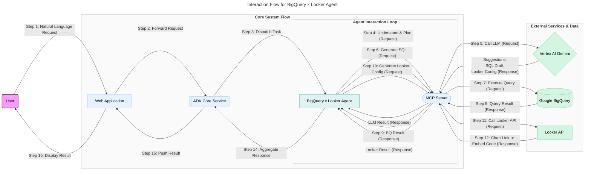

### 数据分析师场景

- **场景 1**：市场部分析师在 Web 应用的聊天框中输入：“帮我分析上个月各产品线的销售额，并按区域生成柱状图，对比去年同期数据。”
- **场景 2**：销售经理提问：“查询本季度销售额排名前十的客户及其对应的销售负责人，并用表格展示。”
  Agent 将理解这些需求，自动生成并执行 BigQuery SQL，然后调用 Looker API 创建或更新相应的图表/表格，并将结果（如 Looker 图表链接或嵌入代码）返回给用户。

### 4.4 技术流程拆解

1.  **用户输入**：用户通过 Web 应用的聊天界面输入自然语言请求。
2.  **请求路由**：Web 应用将认证后的用户请求安全地发送到 ADK 核心服务。
3.  **Agent 激活/路由**：ADK 根据请求类型或元数据（如识别到与数据分析相关的意图），激活或将任务路由到 BigQuery x Looker Agent 的某个实例。
4.  **意图理解与规划**：Agent 通过 MCP 服务器调用 Vertex AI Gemini Pro 模型。Gemini 负责解析用户的自然语言意图，识别关键实体（如指标、维度、时间范围、图表类型），并规划执行步骤（例如：先查询哪些表，如何聚合，生成何种图表）。Gemini 可能会生成初步的 SQL 查询草稿和 Looker 图表配置建议。
5.  **BigQuery 查询生成与执行**：
    - Agent 根据 Gemini 的输出和预定义的业务逻辑（如数据表 Schema、字段含义等），完善并最终确定 SQL 查询语句。
    - Agent 通过 MCP（调用封装了 BigQuery Java/Python SDK 的工具）将 SQL 发送到 BigQuery 执行。
6.  **数据获取与处理**：BigQuery 执行查询并将结果集通过 MCP 返回给 Agent。Agent 可能需要对结果进行初步的验证、转换或格式化，为生成 Looker 图表做准备。
7.  **Looker 可视化生成/更新**：
    - Agent 根据查询结果和用户需求（或 Gemini 的建议），通过 MCP（调用封装了 Looker SDK 或 REST API 的工具）构造创建或更新 Looker 图表（如 Dashboard Element、Look）所需的参数和 API 请求。
    - MCP 调用 Looker API，在 Looker 实例中生成或更新相应的图表。
8.  **结果呈现**：Looker API 返回新图表的访问链接、嵌入式 HTML 代码或操作状态。Agent 将这些信息以及可能的文字总结，通过 ADK 和 Web 应用呈现给用户。用户可以直接在 Web 应用中看到嵌入的 Looker 图表，或点击链接跳转到 Looker 平台进行更深入的交互。
9.  **持续交互与迭代**：用户可以基于当前结果继续提问，例如“将时间范围改为上个季度”或“添加产品类别作为筛选条件”。Agent 将重复步骤 4-8，对查询和图表进行迭代修改和更新。
