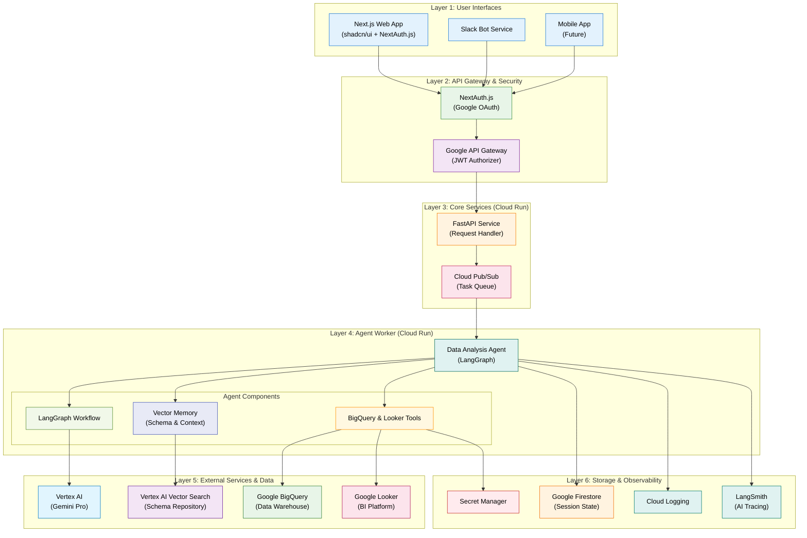
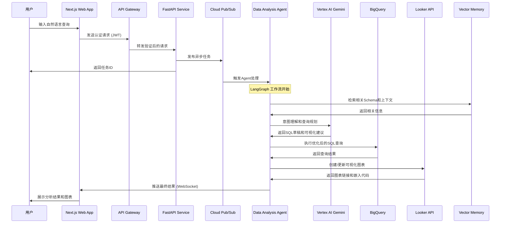

# BigQuery x Looker 数据分析 Agent 开发指南

## 概述

本文档详细描述了 BigQuery x Looker 数据分析 Agent 的设计、实现和部署方案。该 Agent 是 Thrasio IQ 企业级多 Agent 系统的核心组件之一，专门负责处理数据查询、分析和可视化任务。

## 1. Agent 架构设计

### 1.1 技术栈

基于项目技术栈，该 Agent 采用以下核心技术：

- **AI 核心**：
  - **编排框架**：LangGraph（状态管理和工作流编排）
  - **模型服务**：Google Vertex AI（Gemini Pro）
  - **数据校验**：PydanticAI（输入输出验证）
  - **RAG 系统**：LlamaIndex（知识库检索）

- **数据层**：
  - **数据仓库**：Google BigQuery
  - **商业智能**：Google Looker
  - **向量搜索**：Vertex AI Vector Search（Schema 和业务逻辑检索）
  - **状态存储**：Google Firestore（会话状态）

- **部署层**：
  - **计算服务**：Google Cloud Run（Worker 服务）
  - **队列系统**：Google Pub/Sub（异步任务处理）
  - **密钥管理**：Google Secret Manager

### 1.2 项目结构映射

根据项目目录结构，Agent 相关代码分布如下：

```
services/worker/app/
├── agents/
│   ├── base_agent.py              # 基础 Agent 类
│   └── data_analysis_agent.py     # BigQuery x Looker Agent 实现
├── tools/
│   ├── bigquery/
│   │   ├── __init__.py
│   │   ├── client.py              # BigQuery 客户端封装
│   │   ├── query_builder.py       # SQL 查询构建器
│   │   └── schema_manager.py      # Schema 管理
│   └── looker/
│       ├── __init__.py
│       ├── client.py              # Looker API 客户端
│       ├── dashboard_manager.py   # 仪表板管理
│       └── visualization.py       # 可视化配置
├── workflows/
│   └── data_analysis_workflow.py  # LangGraph 工作流定义
├── memory/
│   ├── conversation_memory.py     # 对话记忆
│   └── vector_memory.py           # 向量记忆（Schema 检索）
└── processors/
    └── data_analysis_processor.py # 数据分析任务处理器
```

## 2. 业务场景

### 2.1 核心使用场景

- **场景 1**：市场部分析师在 Next.js Web 应用的聊天界面中输入："帮我分析上个月各产品线的销售额，并按区域生成柱状图，对比去年同期数据。"
- **场景 2**：销售经理通过 Slack Bot 提问："查询本季度销售额排名前十的客户及其对应的销售负责人，并用表格展示。"
- **场景 3**：高管通过移动端询问："生成本年度各部门预算执行情况的趋势分析报告。"

Agent 将理解这些需求，自动生成并执行 BigQuery SQL，然后调用 Looker API 创建或更新相应的图表/表格，并将结果返回给用户。

### 2.2 支持的分析类型

- **描述性分析**：历史数据统计、趋势分析
- **对比分析**：同比、环比、多维度对比
- **预测分析**：基于历史数据的趋势预测
- **实时分析**：近实时数据查询和监控

## 3. 系统架构流程

### 3.1 整体架构图



### 3.2 详细交互流程



## 4. 技术实现详解

### 4.1 LangGraph 工作流设计

```python
# services/worker/app/workflows/data_analysis_workflow.py
from langgraph import StateGraph, END
from typing import TypedDict, List
from pydantic import BaseModel

class AnalysisState(TypedDict):
    user_query: str
    intent: dict
    sql_query: str
    query_results: List[dict]
    visualization_config: dict
    final_response: dict
    error: str

def create_data_analysis_workflow():
    workflow = StateGraph(AnalysisState)
    
    # 定义节点
    workflow.add_node("understand_intent", understand_user_intent)
    workflow.add_node("retrieve_schema", retrieve_relevant_schema)
    workflow.add_node("generate_sql", generate_sql_query)
    workflow.add_node("execute_query", execute_bigquery)
    workflow.add_node("create_visualization", create_looker_visualization)
    workflow.add_node("format_response", format_final_response)
    
    # 定义边和条件
    workflow.add_edge("understand_intent", "retrieve_schema")
    workflow.add_edge("retrieve_schema", "generate_sql")
    workflow.add_edge("generate_sql", "execute_query")
    workflow.add_edge("execute_query", "create_visualization")
    workflow.add_edge("create_visualization", "format_response")
    workflow.add_edge("format_response", END)
    
    # 设置入口点
    workflow.set_entry_point("understand_intent")
    
    return workflow.compile()
```

### 4.2 Agent 工具实现

#### BigQuery 工具

```python
# services/worker/app/tools/bigquery/client.py
from google.cloud import bigquery
from langchain.tools import BaseTool
from pydantic import BaseModel, Field
from typing import Optional, List, Dict

class BigQueryTool(BaseTool):
    name = "bigquery_executor"
    description = "执行BigQuery SQL查询并返回结果"
    
    def __init__(self):
        super().__init__()
        self.client = bigquery.Client()
    
    def _run(self, sql_query: str, **kwargs) -> Dict:
        try:
            query_job = self.client.query(sql_query)
            results = query_job.result()
            
            # 转换为字典格式
            rows = [dict(row) for row in results]
            
            return {
                "success": True,
                "data": rows,
                "row_count": len(rows),
                "schema": [field.name for field in results.schema]
            }
        except Exception as e:
            return {
                "success": False,
                "error": str(e),
                "data": []
            }
```

#### Looker 工具


### 4.3 记忆管理


## 5. 部署配置

### 5.1 Docker 配置

### 5.2 Cloud Run 部署配置

## 6. 监控和可观测性

### 6.1 LangSmith 集成

### 6.2 结构化日志


## 7. 测试策略

### 7.1 单元测试

### 7.2 集成测试


## 8. 性能优化

### 8.1 查询优化

- **查询缓存**：使用 Redis 缓存常用查询结果
- **分区表**：利用 BigQuery 分区表提高查询性能
- **物化视图**：为复杂查询创建物化视图
- **查询优化器**：使用 LLM 优化生成的 SQL 查询

### 8.2 并发处理

- **异步处理**：使用 asyncio 处理并发请求
- **连接池**：维护 BigQuery 和 Looker 的连接池
- **批处理**：对相似查询进行批处理优化

## 9. 安全考虑

### 9.1 数据访问控制

- **行级安全**：基于用户角色的数据访问控制
- **列级加密**：敏感数据列级加密
- **审计日志**：完整的数据访问审计日志

### 9.2 API 安全

- **JWT 验证**：所有 API 请求的 JWT 验证
- **速率限制**：防止 API 滥用的速率限制
- **输入验证**：严格的输入参数验证

## 10. 扩展指南

### 10.1 添加新数据源

1. 在 `services/worker/app/tools/` 下创建新的数据源工具
2. 实现相应的客户端和查询接口
3. 更新 LangGraph 工作流以支持新数据源
4. 添加相应的测试用例

### 10.2 支持新的可视化类型

1. 扩展 Looker 工具以支持新的图表类型
2. 更新可视化配置模式
3. 在前端添加新图表类型的渲染支持
4. 更新用户文档和示例

这个优化后的文档提供了完整的 Agent 开发指南，涵盖了从架构设计到具体实现的所有方面，并与项目的整体技术栈和目录结构保持一致。

        