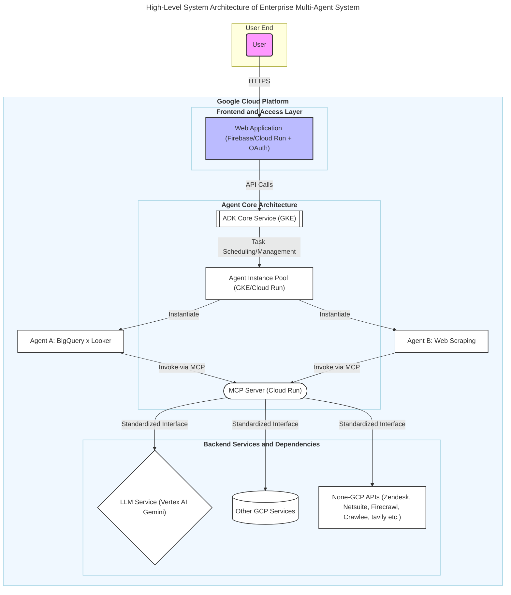
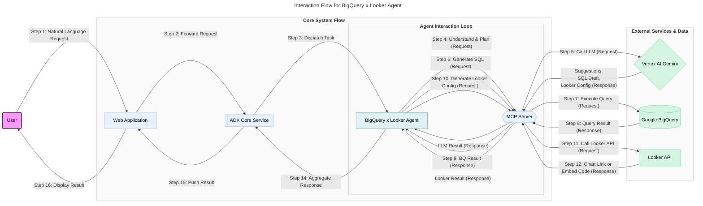

# 企业内部多 Agent 系统技术需求文档

**版本**: 1.0
**日期**: 2025 年 6 月 10 日

## 1. 引言

### 1.1 项目目标

本项目旨在基于 Google Cloud Platform (GCP) 构建一个先进的企业级多 Agent 系统。该系统的核心目标是通过集成多种智能化 Agent，实现特定业务流程的高度自动化和智能化，从而显著提升企业内部运营效率、数据驱动决策能力和员工生产力。我们期望通过此系统，赋能各部门利用 AI 技术解决实际问题，并为未来的智能化升级奠定坚实基础。

### 1.2 文档目的

本文档作为多 Agent 系统项目的技术需求说明，旨在为公司云管理员及相关决策者提供清晰、全面的技术方案参考。内容将详细阐述系统的整体架构、核心组件设计、关键技术选型、具体的 Agent 应用案例、所依赖的 GCP 服务及其初步配置建议、部署策略以及预估的成本范围。本文档将作为后续技术审批、资源规划、开发实施和预算备案的重要依据。

## 2. 系统概述

### 2.1 高层架构

本多 Agent 系统采用模块化、可扩展的架构设计，其核心组件包括用户交互层 (Web 应用)、Agent 开发与管理框架 (ADK)、模型上下文协议服务器 (MCP)、各类功能 Agent 以及底层的 GCP 服务。下图展示了系统的高层架构及主要交互流程：

- **用户 (User)**：系统的最终使用者，通过 Web 应用与 Agent 进行交互。
- **Web 应用 (WebApp)**：作为用户的主要入口，提供聊天界面、表单提交等交互方式。托管在 Firebase 或 Cloud Run 上，集成 OAuth 进行用户认证。
- **ADK 核心服务 (ADK Core)**：Agent Development Kit 的核心，负责 Agent 的生命周期管理、任务调度、状态管理、通信协调等。建议部署在 GKE 上以保证高可用和可伸缩性。
- **Agent 实例池 (Agent Pool)**：运行具体 Agent 逻辑的实例集合，可根据负载动态伸缩，部署在 GKE 或 Cloud Run。
- **MCP 服务器 (MCP Server)**：模型上下文协议服务器，为 Agent 提供统一的、标准化的接口来访问 LLM、GCP 服务及其他外部 API。简化了 Agent 与各种工具的集成。
- **LLM 服务 (Vertex AI Gemini)**：提供核心的自然语言理解、生成和推理能力。
- **其他 GCP 服务**：包括 BigQuery（数据仓库）、Cloud Storage（对象存储）、IAM（权限管理）、Secret Manager（密钥管理）等，为系统提供基础支撑。
- **外部 API**：如 Looker API、第三方抓取服务 API 等，通过 MCP 进行封装和调用。

### 2.2 核心理念

- **模块化设计**：各组件（ADK、MCP、Agent）职责清晰，松耦合，易于独立开发、测试、部署和升级。
- **可扩展性**：系统设计充分考虑横向扩展能力，无论是 Agent 实例数量、用户并发量还是集成的服务种类，都能按需扩展。
- **标准化接口**：MCP 服务器提供标准化的工具调用协议，使得 Agent 可以方便地发现和使用新能力，降低集成复杂度。
- **安全性**：遵循最小权限原则，所有服务间交互均需认证授权，敏感数据加密存储和传输，确保企业数据安全。
- **可观测性**：集成 Cloud Logging 和 Cloud Monitoring，提供全面的日志收集和性能监控，便于问题排查和系统优化。

## 3. 核心组件详解

### 3.1 MCP (Model Context Protocol) 服务器

- **定义与目的**：MCP 服务器是连接 Agent 与外部世界（包括 LLM、GCP 服务、第三方 API 等）的关键桥梁。它提供了一个标准化的协议和运行时环境，允许 Agent 动态发现、配置和调用各种“工具”或“能力”，从而极大地简化了 Agent 的开发和集成工作。
- **关键功能**：
  - **工具注册与发现**：支持动态注册新的工具（如 BigQuery 查询执行器、Looker 图表生成器、网页抓取器等），Agent 可以查询可用的工具列表及其使用方法。
  - **标准化调用**：Agent 通过统一的格式向 MCP 发起工具调用请求，MCP 负责将请求路由到正确的工具实现，并处理参数转换和结果返回。
  - **上下文管理**：协助管理 Agent 与工具交互过程中的上下文信息。
  - **安全与认证**：集成 IAM，确保只有授权的 Agent 才能调用特定的工具，并安全地管理访问外部服务所需的凭证（通过 Secret Manager）。
- **部署建议**：推荐将 MCP 服务器部署为 GCP 上的 Cloud Run 服务。这提供了良好的可伸缩性、按需付费的成本效益以及简化的管理。对于高并发或有状态的 MCP 工具，也可考虑部署在 GKE 上。
- **成本考量**：MCP 软件本身是开源的（假设），但其运行依赖的 Cloud Run 或 GKE 会产生计算和网络费用。用户初稿中提及的“MCP, free”应理解为软件许可免费。

### 3.2 ADK (Agent Development Kit)

- **定义与目的**：ADK 是一个综合性的开发和运行框架，旨在标准化和加速企业内部多 Agent 系统的构建、部署和管理。它提供了一套通用的工具、库、API 以及最佳实践，使开发团队能够更高效地创建功能强大且行为一致的 Agent。
- **关键功能**：
  - **Agent 生命周期管理**：提供创建、配置、启动、停止、监控和更新 Agent 实例的标准化流程和 API。
  - **通信总线/消息队列**：实现 ADK 核心服务与各 Agent 实例之间、以及 Agent 实例之间的可靠异步通信（可基于 Pub/Sub）。
  - **状态管理**：为 Agent 提供持久化和共享状态的能力，例如使用 Firestore 或 Cloud Memorystore 存储 Agent 的配置、会话数据或中间结果。
  - **任务编排与调度**：支持定义和执行复杂的多 Agent 协作流程，例如通过工作流引擎或自定义调度逻辑。
  - **统一日志与监控**：与 Cloud Logging 和 Cloud Monitoring 深度集成，提供集中的 Agent 行为日志、性能指标和告警机制。
  - **可插拔的 Agent 模板**：提供基础的 Agent 模板和 SDK，简化新 Agent 的开发。
- **部署建议**：ADK 的核心服务（如任务调度器、状态管理器、API 网关等）建议部署在 GCP 的 Kubernetes Engine (GKE) 上，以获得高可用性、可伸缩性和灵活的资源配置。Agent 实例本身可以根据其特性部署在 GKE Pod 中或作为独立的 Cloud Run 服务。
- **成本考量**：用户初稿中“ADK, free, on GCP, need VM or k8s of GCP to host the ADK, <100$ per month”指 ADK 框架本身可能开源，实际成本主要来自 GKE 集群或 Cloud Run 的计算、存储和网络资源消耗。

## 4. 详细设计案例一：BigQuery x Looker Agent

### 4.1 目标

该 Agent 旨在通过自然语言交互，赋能用户轻松查询存储在 BigQuery 中的数据，并能自动在 Looker 中生成或更新相关的数据可视化图表。其核心价值在于简化数据分析流程，降低数据访问门槛，使得非技术用户也能快速从数据中获取洞察并进行可视化展示。

### 4.2 用户场景

- **场景 1**：市场部分析师在 Web 应用的聊天框中输入：“帮我分析上个月各产品线的销售额，并按区域生成柱状图，对比去年同期数据。”
- **场景 2**：销售经理提问：“查询本季度销售额排名前十的客户及其对应的销售负责人，并用表格展示。”
  Agent 将理解这些需求，自动生成并执行 BigQuery SQL，然后调用 Looker API 创建或更新相应的图表/表格，并将结果（如 Looker 图表链接或嵌入代码）返回给用户。

### 4.4 技术流程拆解

1.  **用户输入**：用户通过 Web 应用的聊天界面输入自然语言请求。
2.  **请求路由**：Web 应用将认证后的用户请求安全地发送到 ADK 核心服务。
3.  **Agent 激活/路由**：ADK 根据请求类型或元数据（如识别到与数据分析相关的意图），激活或将任务路由到 BigQuery x Looker Agent 的某个实例。
4.  **意图理解与规划**：Agent 通过 MCP 服务器调用 Vertex AI Gemini Pro 模型。Gemini 负责解析用户的自然语言意图，识别关键实体（如指标、维度、时间范围、图表类型），并规划执行步骤（例如：先查询哪些表，如何聚合，生成何种图表）。Gemini 可能会生成初步的 SQL 查询草稿和 Looker 图表配置建议。
5.  **BigQuery 查询生成与执行**：
    - Agent 根据 Gemini 的输出和预定义的业务逻辑（如数据表 Schema、字段含义等），完善并最终确定 SQL 查询语句。
    - Agent 通过 MCP（调用封装了 BigQuery Java/Python SDK 的工具）将 SQL 发送到 BigQuery 执行。
6.  **数据获取与处理**：BigQuery 执行查询并将结果集通过 MCP 返回给 Agent。Agent 可能需要对结果进行初步的验证、转换或格式化，为生成 Looker 图表做准备。
7.  **Looker 可视化生成/更新**：
    - Agent 根据查询结果和用户需求（或 Gemini 的建议），通过 MCP（调用封装了 Looker SDK 或 REST API 的工具）构造创建或更新 Looker 图表（如 Dashboard Element、Look）所需的参数和 API 请求。
    - MCP 调用 Looker API，在 Looker 实例中生成或更新相应的图表。
8.  **结果呈现**：Looker API 返回新图表的访问链接、嵌入式 HTML 代码或操作状态。Agent 将这些信息以及可能的文字总结，通过 ADK 和 Web 应用呈现给用户。用户可以直接在 Web 应用中看到嵌入的 Looker 图表，或点击链接跳转到 Looker 平台进行更深入的交互。
9.  **持续交互与迭代**：用户可以基于当前结果继续提问，例如“将时间范围改为上个季度”或“添加产品类别作为筛选条件”。Agent 将重复步骤 4-8，对查询和图表进行迭代修改和更新。

### 4.5 依赖的 GCP 服务及关键配置

- **Vertex AI Gemini Pro**：
  - **用途**：自然语言理解，SQL 生成辅助，Looker 配置建议。
  - **配置**：启用 Vertex AI API。确保服务账户拥有调用权限。根据预期负载选择合适的模型端点和请求配额。考虑使用私有端点（Private Endpoints）增强网络安全。
- **BigQuery**：
  - **用途**：存储核心业务数据，执行 SQL 查询。
  - **配置**：数据集和表结构需清晰定义，并进行适当的权限管理。Agent 访问 BigQuery 应通过具有最小必要权限（如`roles/bigquery.dataViewer`, `roles/bigquery.jobUser`）的服务账户。考虑查询优化（如分区表、集群表）和成本控制（设置用户/项目级查询配额）。
- **Looker (或 Looker Studio Pro)**：
  - **用途**：数据可视化平台，通过 API/SDK 创建、更新和嵌入图表。
  - **配置**：确保 Looker API 已启用。为 Agent 创建一个专用的 Looker API 用户或使用服务账户（如果 Looker 版本支持），并授予其创建和修改内容的必要权限。记录 API 端点、客户端 ID 和密钥，并通过 Secret Manager 安全传递给 Agent。
- **Google Kubernetes Engine (GKE) / Cloud Run**：
  - **用途**：托管 ADK 核心服务、BigQuery x Looker Agent 实例、MCP 服务器。
  - **配置 (GKE)**：配置节点池（可使用 Autopilot 简化管理），设置 HPA（Horizontal Pod Autoscaler）实现自动伸缩。使用 Workload Identity 将 GCP 服务账户关联到 Kubernetes 服务账户，实现安全的 GCP API 访问。配置网络策略限制 Pod 间通信。
  - **配置 (Cloud Run)**：为服务配置合适的 CPU、内存、并发数和自动伸缩参数。使用服务账户进行身份验证和 GCP 服务访问。
- **Firebase / Cloud Run (用于 Web 应用)**：
  - **用途**：托管前端用户界面，处理用户认证 (Firebase Authentication / Google Identity Platform) 和会话管理。
  - **配置**：Firebase Hosting 用于静态资源部署。Cloud Functions 或 Cloud Run 可用于处理 Web 应用的后端逻辑（如 API 请求转发）。
- **IAM (Identity and Access Management)**：
  - **用途**：集中管理所有 GCP 服务和资源的访问权限。
  - **配置**：遵循最小权限原则。为每个组件创建专用服务账户，并仅授予其执行任务所需的最小 IAM 角色。
- **Secret Manager**：
  - **用途**：安全存储和管理 Looker API 凭证、数据库密码等敏感信息。
  - **配置**：为需要访问密钥的服务账户授予`roles/secretmanager.secretAccessor`角色。
- **Cloud Logging & Cloud Monitoring**：
  - **用途**：收集所有组件的日志和指标，用于调试、监控系统健康状况和性能分析。
  - **配置**：确保所有服务（GKE Pods, Cloud Run services, Cloud Functions）都配置为将结构化日志发送到 Cloud Logging。在 Cloud Monitoring 中为关键指标（如 API 错误率、请求延迟、资源利用率）设置告警策略。

### 4.6 安全考量

- **认证与授权**：用户通过 OAuth 2.0 (如 Google Sign-In) 登录 Web 应用。服务间通信（WebApp 到 ADK，ADK 到 Agent，Agent 到 MCP，MCP 到 GCP 服务/Looker API）必须使用基于服务账户的认证和 IAM 授权。
- **数据安全**：
  - **传输中加密**：所有网络通信（用户到 WebApp，服务内部，服务到外部 API）强制使用 TLS/SSL。
  - **静态加密**：GCP 默认对存储在 BigQuery、Cloud Storage 等服务中的数据进行静态加密。敏感数据可考虑使用客户管理的加密密钥 (CMEK)。
  - **数据访问控制**：严格控制 Agent 对 BigQuery 中数据的访问权限，确保其只能访问授权的数据集和表，并防止 SQL 注入。
- **API 安全**：保护对 Vertex AI Gemini API 和 Looker API 的访问。API 密钥和凭证通过 Secret Manager 安全管理，并定期轮换。
- **网络安全**：
  - 使用 VPC 网络和防火墙规则限制服务间的非必要访问。
  - 考虑将 GKE 集群配置为私有集群，通过内部负载均衡器或 VPC Service Controls 进行访问控制。
  - Cloud Run 服务可配置入站流量控制，仅允许来自特定 VPC 或认证用户的访问。
- **输入验证与输出编码**：对用户输入进行严格验证，防止恶意输入。对输出到 Web 应用的内容（尤其是 HTML 嵌入代码）进行适当编码，防止 XSS 攻击。
- **依赖项安全**：定期扫描和更新所有软件库和容器镜像的依赖项，及时修补已知漏洞。

## 5. 详细设计案例二：网页抓取 Agent (Web Scraper Agent)

### 5.1 目标

该 Agent 旨在提供一个自动化的网页内容抓取和信息提取解决方案。用户可以通过自然语言指定目标网站 URL、搜索查询或描述需要抓取的信息类型，Agent 将负责执行抓取任务，并可选择将提取的结构化数据存入 BigQuery 或直接返回给用户。这有助于从公开网络获取数据用于市场分析、竞品研究、内容聚合等场景。

### 5.2 用户场景

- **场景 1**：研究员指示：“帮我抓取[某行业新闻网站]上过去一周所有关于‘人工智能伦理’的文章，提取标题、发布日期和摘要，并存入 BigQuery 的‘AI_News’表。”
- **场景 2**：产品经理提问：“搜索关于‘GCP 最新发布的 Serverless 产品’的官方博客和新闻，总结主要特性和发布日期。”

### 5.3 架构与流程简述

```mermaid
---
title: Interaction Flow for Web Scraper Agent
---
flowchart LR
    User("User"):::actorStyle

    subgraph Core_Scraper_Flow [Core Scraper System Flow]
        direction TB
        WebApp_Scraper_Node["Web Application"]:::systemNodeStyle
        ADK_Core_Scraper_Node[["ADK Core Service"]]:::systemNodeStyle

        subgraph Scraper_Agent_Interaction_Loop [Scraper Agent Interaction Loop]
            direction TB
            Scraper_Agent["Web Scraper Agent"]:::agentNodeStyle
            MCP_Server_Scraper_Node(["MCP Server"]):::systemNodeStyle
        end
    end

    subgraph External_Targets_And_Services [External Targets & Services]
        direction TB
        Gemini_Scraper_Node{"Vertex AI Gemini"}:::externalNodeStyle
        WebScrapingTool["Web Scraping Service<br>(Firecrawl/Tavily)"]:::externalNodeStyle
        TargetWebsite(("Target Website")):::targetNodeStyle
        BigQuery_Scraper_Node[("BigQuery")]:::externalNodeStyle
    end

    %% Flow Steps
    User -- "Step 1: Scrape Request" --> WebApp_Scraper_Node
    WebApp_Scraper_Node -- "Step 2: Forward Request" --> ADK_Core_Scraper_Node
    ADK_Core_Scraper_Node -- "Step 3: Dispatch Task" --> Scraper_Agent

    Scraper_Agent -- "Step 4: Understand & Plan (Request)" --> MCP_Server_Scraper_Node
    MCP_Server_Scraper_Node -- "Step 5: Call Gemini (Request)" --> Gemini_Scraper_Node
    Gemini_Scraper_Node -- "Scraping Target<br>Identification (Response)" --> MCP_Server_Scraper_Node
    MCP_Server_Scraper_Node -- "Gemini Result (Response)" --> Scraper_Agent

    Scraper_Agent -- "Step 6: Call Scraping Tool (Request)" --> MCP_Server_Scraper_Node
    MCP_Server_Scraper_Node -- "Step 7: Execute Scraping (Request)" --> WebScrapingTool
    WebScrapingTool -- "HTTP(S)" --> TargetWebsite
    TargetWebsite -- "HTML/Data (Response)" --> WebScrapingTool
    WebScrapingTool -- "Step 8: Return Content (Response)" --> MCP_Server_Scraper_Node
    MCP_Server_Scraper_Node -- "Step 9: Content for Agent (Response)" --> Scraper_Agent

    %% Optional Steps with dotted lines
    Scraper_Agent -. "Step 10: Extract Data (Optional Request)" .-> MCP_Server_Scraper_Node
    MCP_Server_Scraper_Node -. "Step 11: Call Gemini for Extraction (Optional Request)" .-> Gemini_Scraper_Node
    Gemini_Scraper_Node -. "Structured Data (JSON) (Optional Response)" .-> MCP_Server_Scraper_Node
    MCP_Server_Scraper_Node -. "Extraction Result (Optional Response)" .-> Scraper_Agent

    Scraper_Agent -. "Step 12: Store Data (Optional Request)" .-> MCP_Server_Scraper_Node
    MCP_Server_Scraper_Node -. "Step 13: Write to BigQuery (Optional Request)" .-> BigQuery_Scraper_Node

    %% Finalizing and Displaying Result
    Scraper_Agent -- "Step 14: Aggregate Response" --> ADK_Core_Scraper_Node
    ADK_Core_Scraper_Node -- "Step 15: Push Result" --> WebApp_Scraper_Node
    WebApp_Scraper_Node -- "Step 16: Display Result/Status" --> User

    %% Style Definitions
    classDef actorStyle fill:#f9f,stroke:#333,stroke-width:2px,color:black
    classDef systemNodeStyle fill:#e6f2ff,stroke:#a4c9ff,color:black
    classDef agentNodeStyle fill:#e0f2f1,stroke:#4db6ac,color:black
    classDef externalNodeStyle fill:#d5f5e3,stroke:#58d68d,color:black
    classDef targetNodeStyle fill:#fdebd0,stroke:#f5b041,color:black
    classDef subgraphStyle fill:#fafafa,stroke:#d3d3d3,stroke-width:1.5px,color:#333,font-weight:bold
    class Core_Scraper_Flow,Scraper_Agent_Interaction_Loop,External_Targets_And_Services subgraphStyle
```

### 5.4 技术流程拆解

1.  **用户输入**：用户通过 Web 应用提供目标 URL、搜索关键词、或描述需要抓取的信息类型和范围。
2.  **请求路由与 Agent 激活**：与案例一类似，ADK 将任务路由到网页抓取 Agent。
3.  **意图理解与规划**：Agent 调用 Gemini 解析用户需求，识别抓取目标（具体 URL、搜索词）、需要提取的关键信息字段、以及可能的抓取策略（如是否需要深度抓取、是否需要登录等）。
4.  **网页抓取执行**：
    - Agent 通过 MCP 调用专门的网页抓取工具。这里强烈推荐使用集成的 MCP 工具，例如 `mcp-server-firecrawl` 提供的 `firecrawl_scrape` (单个 URL)、`firecrawl_search` (结合搜索抓取) 或 `firecrawl_crawl` (站点爬取)。如果需要更广泛的搜索引擎能力，可考虑 `tavily-mcp` 的 `tavily-search`。
    - MCP 工具负责处理实际的 HTTP 请求、HTML 解析、动态内容渲染（如果支持）、以及基本的反抓取应对。
5.  **内容提取与结构化 (可选)**：
    - 抓取工具返回原始 HTML 或处理过的 Markdown 内容。如果需要从中提取特定的结构化信息（如文章标题、作者、价格、评论等），Agent 可再次通过 MCP 调用 Gemini (例如使用 `firecrawl_extract` 工具，它内部也可能使用 LLM) 或自定义的解析逻辑，将非结构化内容转换为 JSON 或其他结构化格式。
6.  **数据存储 (可选)**：如果用户要求或预设流程需要，提取出的结构化数据可以通过 MCP（调用 BigQuery 写入工具）存入 BigQuery 中的指定数据集和表。
7.  **结果呈现**：抓取的原始内容摘要、提取的结构化数据、或数据存储操作的状态，将通过 ADK 和 Web 应用返回给用户。对于长时间运行的抓取任务，应提供任务状态更新。

### 5.5 依赖的 GCP 服务 (除通用服务外)

- **Secret Manager**：安全存储访问外部抓取服务（如 Firecrawl、Tavily 等，如果它们需要 API 密钥）的凭证。
- **Cloud Scheduler (可选)**：如果需要定期执行重复性的抓取任务（如每日抓取特定新闻源），可以使用 Cloud Scheduler 配置定时触发器，调用 Agent 执行任务。
- **Pub/Sub (可选)**：对于大规模、并发或长时间运行的抓取任务，可以使用 Pub/Sub 作为任务队列。Agent 将抓取请求作为消息发布到 Topic，由多个 Worker 实例订阅并处理，实现任务解耦和弹性伸缩。
- **Artifact Registry (或类似容器镜像仓库)**：存储网页抓取 Agent 及 MCP 工具的容器镜像。

### 5.6 特定安全与合规考量

- **遵守 Robots.txt**：Agent 在抓取任何网站前，必须检查并严格遵守目标网站的 `robots.txt` 文件中定义的规则，尊重网站所有者的意愿。
- **速率限制与礼貌抓取 (Rate Limiting & Polite Crawling)**：Agent 必须实现合理的请求间隔和重试机制，避免在短时间内对目标服务器发起过多请求，防止对目标网站造成不必要的负载或被封禁。配置 User-Agent 明示抓取行为。
- **处理动态内容和反抓取机制**：选择的抓取工具（如 Firecrawl）应具备处理 JavaScript 渲染页面的能力。对于复杂的反抓取机制，可能需要更专业的工具或服务，并需谨慎评估其使用是否合规。
- **数据隐私与版权**：抓取和存储数据时，必须严格遵守相关的法律法规，特别是关于个人数据保护（如 GDPR, CCPA）和内容版权的规定。不得抓取、存储或使用受保护的个人敏感信息或版权内容，除非获得明确授权。
- **透明度与可追溯性**：记录抓取任务的来源、目标、时间及抓取内容的元数据，确保抓取行为的透明度和可追溯性。
- **错误处理与容错**：抓取过程中可能遇到网络错误、目标网站结构变更等问题。Agent 应具备健壮的错误处理和重试逻辑。

## 6. 通用 GCP 服务需求 (适用于所有 Agent)

### 6.1 网络配置

- **VPC (Virtual Private Cloud)**：为所有 GCP 资源创建一个或多个自定义模式的 VPC 网络，以实现逻辑隔离和精细化的安全控制。
- **子网 (Subnets)**：在 VPC 内按区域划分逻辑子网，用于部署不同类型的组件。
- **防火墙规则 (Firewall Rules)**：基于标签或服务账户，精细控制 VPC 内部以及与外部网络之间的入站和出站流量。
- **Cloud NAT (可选)**：为私有网络中的服务提供安全的出站连接。
- **Private Google Access**：允许 VPC 网络中的资源在不通过公共互联网的情况下访问 Google API 和服务。
- **VPC Service Controls (可选)**：建立服务边界，防止数据泄露。

### 6.2 身份与访问管理 (IAM)

- **服务账户 (Service Accounts)**：为每个应用组件创建专用的 GCP 服务账户。
- **最小权限原则**：为每个服务账户仅授予其执行预定任务所必需的最小 IAM 角色和权限。
- **Workload Identity (GKE)**：在 GKE 中，使用 Workload Identity 将 GCP 服务账户安全地映射到 Kubernetes 服务账户。
- **角色管理**：优先使用预定义的 IAM 角色，必要时创建自定义 IAM 角色。
- **定期审计**：定期审查 IAM 策略和服务账户权限。

### 6.3 日志与监控 (Cloud Operations Suite)

- **Cloud Logging**：集中收集所有 GCP 服务和应用组件的结构化日志。
- **Cloud Monitoring**：收集标准和自定义指标，创建仪表盘，并设置告警策略。
- **Cloud Trace (可选)**：用于分布式追踪，分析性能瓶颈。

### 6.4 数据存储与处理 (通用)

- **Cloud Storage**：用于存储临时文件、用户上传的文件、备份数据等。
- **Firestore / Cloud Memorystore**：用于状态管理、缓存、会话数据等。
- **Secret Manager**：用于安全地存储和管理 API 密钥、密码等敏感信息。

## 7. 部署策略建议

### 7.1 基础设施即代码 (IaC)

- **工具**：推荐使用 Terraform 或 Google Cloud Deployment Manager。
- **优势**：实现基础设施的可重复性、版本控制、自动化部署和变更管理。

### 7.2 持续集成与持续部署 (CI/CD)

- **工具**：使用 Cloud Build、Jenkins、GitLab CI/CD 或 GitHub Actions。
- **流程**：代码提交 -> 构建与测试 (CI) -> 部署到测试环境 (CD) -> 验收测试 (UAT) -> 部署到生产环境 (CD)。

### 7.3 容器化与编排

- **容器化 (Docker)**：将所有后端组件打包为 Docker 容器镜像。
- **容器编排 (GKE)**：用于 ADK 核心服务、Agent 实例等，实现自动伸缩、故障恢复、滚动更新。
- **Serverless (Cloud Run)**：适用于无状态或轻量级服务，如 MCP 服务器。

### 7.4 环境分离

- **多环境策略**：至少维护开发、测试和生产三套独立环境。
- **资源隔离**：每个环境使用独立的 GCP 项目或 VPC。

### 7.5 配置管理

- **外部化配置**：通过环境变量或配置文件注入。
- **敏感配置管理**：使用 Secret Manager。
- **版本控制**：配置文件纳入版本控制。

## 8. 预算估算与说明

**免责声明**：以下估算为初步参考，实际成本会因使用量、配置、区域及 GCP 定价调整而异。建议使用 GCP Pricing Calculator 进行精确估算，并设置 Billing Alerts。

### 8.1 成本组成分析

下表详细分析了系统各主要组件的预估月度成本。估算分为“保守”和“优化”两种场景，以便进行更全面的预算规划。

| 服务组件                          | 保守估算 (月) | 优化估算 (月) | 说明                                                                                                                              |
| :-------------------------------- | :------------ | :------------ | :-------------------------------------------------------------------------------------------------------------------------------- |
| **一、核心计算资源**              |               |               | _承载系统核心应用与服务_                                                                                                          |
| ┣ GKE / Cloud Run (ADK 及 Agents) | $100          | $50           | **保守**: 采用 GKE 标准节点池，预留较多计算资源。 **优化**: 优先采用 Cloud Run 或 GKE Autopilot 模式，实现更精细化的按需付费。 |
| ┣ Cloud Run (MCP 服务器)          | $20           | $10           | **说明**: MCP 服务设计为无状态轻量级应用，Cloud Run 可提供高性价比的托管方案。                                                    |
| ┣ Cloud Run / Firebase (Web 应用) | $50           | $30           | **说明**: 成本受用户流量及后端逻辑复杂度影响。Firebase Hosting 提供一定免费额度。                                                 |
| **二、核心 AI 与数据服务**        |               |               | _提供智能化处理与数据分析能力_                                                                                                    |
| ┣ Vertex AI Gemini API            | $100          | $30           | **保守**: 基于较高的 API 调用频率和较复杂的 Prompt 设计。 **优化**: 通过 Prompt 优化、结果缓存及减少非必要调用来有效控制成本。 |
| ┣ BigQuery (数据存储与分析)       | $50           | $20           | **说明**: 成本与数据存储量及查询复杂度直接相关。可通过表分区、集群化及查询优化策略降低。                                          |
| **三、其他支撑服务**              |               |               | _保障系统稳定运行的基础服务_                                                                                                      |
| ┣ 日志、监控及存储等辅助服务      | $30           | $20           | **说明**: 包括 Cloud Logging, Cloud Monitoring, Cloud Storage 等服务的费用，通常在总成本中占比较小。                              |
| **四、预估月度总成本**            | **约 $350**   | **约 $160**   | _总成本为各项服务估算之和，具体数值取决于实际用量与配置。_                                                                        |

**成本评估总结**:

- **保守估算 ($350/月)**：此估算基于系统初期较高的资源预留和较为频繁的 API 调用场景，为预算提供了充足的缓冲。
- **优化估算 ($160/月)**：通过积极采用 Serverless 架构（Cloud Run）、优化资源配置（GKE Autopilot）和控制 API 调用（特别是 LLM），可以将成本显著降低。这是在系统稳定运行后，经过持续优化可以达到的目标。
- **与初稿对比**：用户初稿中提到的总计`$900/月`（LLM $500 + ADK $100 + WebApp $300）可能对 LLM 和 Web 应用的用量估计过高。本分析提供的估算更为细化和现实，但强烈建议在项目进入实施阶段前，使用 **GCP Pricing Calculator** 结合预期的具体用量进行一次精确计算。

### 8.2 人力与时间成本估算

除了上述的云服务资源成本外，项目的成功交付还依赖于专业的人力投入和合理的时间规划。下表对项目各主要阶段的人力需求和预估周期进行了分析。请注意，这些估算基于项目范围和复杂性的初步理解，实际投入可能因具体需求调整、团队经验和并行工作程度而有所不同。

| 阶段                      | 主要任务                                                                     | 主要参与角色                           | 预估周期 (人周)   | 说明与假设                                                                                                                     |
| :------------------------ | :--------------------------------------------------------------------------- | :------------------------------------- | :---------------- | :----------------------------------------------------------------------------------------------------------------------------- |
| **1. 项目启动与规划**     | 需求详细调研、技术选型确认、项目计划制定、风险评估                           | 项目经理、核心技术负责人、业务分析师   | 2-4               | 假设需求相对明确，关键干系人配合度高。                                                                                         |
| **2. 核心架构设计与搭建** | ADK 核心服务设计与开发、MCP 服务器配置与工具封装、基础认证与权限体系建立     | 资深后端工程师、DevOps 工程师          | 4-6               | 重点在于构建可扩展、安全的基础框架。                                                                                           |
| **3. Agent 开发 (每个)**  | 针对具体业务场景（如 BigQuery x Looker, Web Scraper）的 Agent 逻辑实现与测试 | 中/高级后端工程师、(可能)数据工程师    | 3-5               | 此为单个典型 Agent 的估算，多个 Agent 可并行开发，总时间取决于 Agent 数量和复杂度。假设开发两个核心 Agent。                    |
| **4. Web 应用开发**       | 用户交互界面设计 (UI/UX)、前端功能实现、与后端 ADK 服务集成                  | UI/UX 设计师、前端工程师               | 4-8               | 复杂度取决于交互界面的丰富程度和用户体验要求。                                                                                 |
| **5. 系统集成与测试**     | 各模块联调、端到端测试、性能测试、安全测试                                   | QA 工程师、全体开发团队                | 3-5               | 确保系统各组件协同工作正常，满足性能和安全要求。                                                                               |
| **6. 部署与上线准备**     | 生产环境搭建、CI/CD 流水线配置、数据迁移 (如需)、上线演练                    | DevOps 工程师、后端工程师              | 2-3               | 确保平稳上线。                                                                                                                 |
| **7. 文档编写与用户培训** | 技术文档、用户手册编写、组织用户培训                                         | 技术文档工程师、项目经理、核心开发人员 | 1-2               | 确保知识传递和用户顺利上手。                                                                                                   |
| **预估总周期 (串行)**     | -                                                                            | -                                      | **19-33 周**      | 这是一个简化的串行估算。实际项目中，许多阶段可以并行，从而缩短总体交付时间。例如，Agent 开发和 Web 应用开发可以大部分并行。    |
| **预估总人力投入**        | -                                                                            | -                                      | **约 20-40 人周** | 估算基于上述各阶段人周数累加，具体取决于团队规模和并行程度。例如，若两个 Agent 并行开发，则 Agent 开发阶段的人周数会计入总数。 |

**重要说明**:

- **人周 (Person-Week)**：指一个人全职工作一周所投入的工时。
- **团队规模与构成**: 上述估算未指定具体的团队人数，而是侧重于总工作量。实际项目周期会受团队规模、成员经验及并行开发能力的影响。例如，增加开发人员可以并行处理更多任务，从而可能缩短日历时间，但总人周数可能不会等比例减少（甚至可能因沟通成本增加而略有上升）。
- **迭代开发**: 建议采用敏捷迭代的开发模式，将项目分解为更小的、可交付的增量，有助于早期风险识别和需求调整。
- **未包含成本**: 此估算主要关注直接的人力投入，未包含招聘成本、管理费用、办公场地、硬件设备以及第三方商业软件许可（如特定开发工具、高级版 Looker 等）的成本。

此人力与时间成本估算旨在提供一个初步的规划参考。在项目正式启动前，建议根据更详细的需求和资源情况进行细化调整。

### 8.3 成本优化建议

- **选择合适的 GCP 区域**以降低延迟和成本。
- 充分利用 GCP 的**免费套餐**和**持续使用折扣**。
- 为 GKE 节点和 Cloud Run 服务配置**自动伸缩**，按需付费。
- 优化 BigQuery 查询，使用**分区表和集群表**。
- 监控 LLM 调用，**优化 prompt**和调用频率。
- 定期审查 GCP 账单，识别和消除不必要的开销。

## 9. 未来展望与扩展性

本系统设计具有良好的前瞻性和扩展性，为未来引入更多高级功能和 Agent 奠定了基础。

- **更多 Agent 类型**：
  - **文档问答 Agent**：连接到公司内部知识库（如 Google Drive、Confluence），通过 LLM 实现自然语言问答。
  - **代码生成/辅助 Agent**：集成到 IDE 或代码仓库，辅助开发人员编写代码、生成测试用例、解释代码片段等。
  - **CRM 集成 Agent**：连接到 Salesforce 等 CRM 系统，自动执行客户数据更新、报告生成等任务。
  - **IoT 设备控制 Agent**：与物联网平台集成，通过自然语言控制和监控智能设备。
- **增强的 Agent 能力**：
  - **多模态交互**：支持图像、语音输入输出，不仅仅是文本。
  - **主动学习与个性化**：Agent 能从用户交互中学习，并根据用户偏好提供更个性化的服务。
  - **更复杂的任务编排**：支持更长、更复杂的 Agent 协作流程，实现端到端的业务自动化。
- **平台级增强**：
  - **Agent 市场/发现机制**：允许用户或开发者在企业内部共享和发现已有的 Agent。
  - **精细化权限与治理**：更细粒度的 Agent 访问控制和行为审计。
  - **A/B 测试框架**：用于评估不同 Agent 版本或 LLM 模型的效果。

## 10. 总结与建议

### 10.1 总结

本文档详细阐述了基于 GCP 的企业级多 Agent 系统的技术方案。该方案以 ADK 为核心框架，通过 MCP 实现 Agent 与各类工具（包括 Vertex AI Gemini、BigQuery、Looker 及外部服务）的灵活集成。通过两个具体案例（BigQuery 数据分析与网页抓取），展示了系统的强大功能和应用潜力。该架构具备高可扩展性、安全性和可维护性，能够满足企业当前及未来的自动化和智能化需求。

### 10.2 建议

1.  **分阶段实施**：建议采用敏捷迭代的方式，从 1-2 个高价值的 Agent 案例（如 BigQuery x Looker Agent）开始进行原型验证和开发（PoC），成功后再逐步扩展到更多业务场景。
2.  **成立专项团队**：组建一个包含产品经理、软件工程师（前后端、DevOps）、数据工程师和 UI/UX 设计师的跨职能团队，以确保项目的顺利推进和高质量交付。
3.  **持续关注 GCP 技术发展**：GCP 平台和 AI 技术日新月异，团队应持续学习和评估新技术（如最新的 Gemini 模型、GKE 新功能等），并将其应用于系统优化中。
4.  **用户培训与反馈收集**：项目上线后，需对目标用户进行充分的培训，并建立有效的反馈渠道（如内置反馈表单），以便持续改进 Agent 的功能和用户体验。
5.  **成本监控与优化**：在项目初期就建立严格的成本监控机制，使用 GCP 预算和告警功能，定期审查资源使用情况，并持续寻找成本优化的机会。

## 11. 附录 (可选)

- 词汇表
- 详细 API 列表
- 更详细的网络拓扑图
