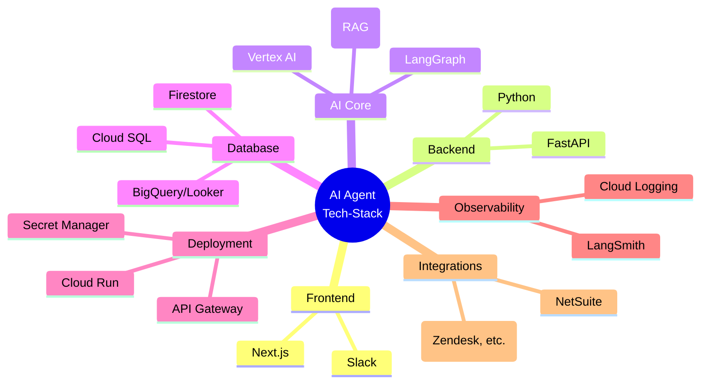

## 技术栈总结

本附录旨在通过列表和图表的形式，归纳总结构建本报告所述的企业级多 Agent 系统所涉及到的核心技术栈。

### 技术栈列表

-   **前端 (Frontend)**
    -   **框架**: Next.js
    -   **UI 组件库**: shadcn/ui, Material-UI (MUI), Ant Design
    -   **认证**: NextAuth.js (Auth.js)

-   **后端 (Backend)**
    -   **语言**: Python
    -   **Web 框架**: FastAPI

-   **AI 核心 (AI Core)**
    -   **编排框架**: LangGraph
    -   **数据索引 (RAG)**: LlamaIndex
    -   **模型服务**: Google Vertex AI
    -   **数据校验**: PydanticAI

-   **数据存储与分析 (Database & Analytics)**
    -   **状态/短期记忆 (NoSQL)**: Google Firestore
    -   **长期记忆 (SQL)**: Google Cloud SQL
    -   **向量数据库**: Vertex AI Vector Search
    -   **数据仓库 (DWH)**: Google BigQuery
    -   **商业智能 (BI)**: Google Looker

-   **部署与托管 (Deployment & Hosting)**
    -   **网关**: Google API Gateway (with JWT Authorizer)
    -   **计算服务**: Google Cloud Run
    -   **凭证管理**: Google Secret Manager

-   **可观测性 (Observability)**
    -   **应用/业务日志**: Google Cloud Logging
    -   **AI 链路追踪**: LangSmith

-   **外部集成 (Integrations)**
    -   **通信**: Slack
    -   **企业系统 (SaaS)**: Netsuite, Zendesk, Gmail, Monday.com, etc.

### 技术栈图 (Mermaid Mindmap)

