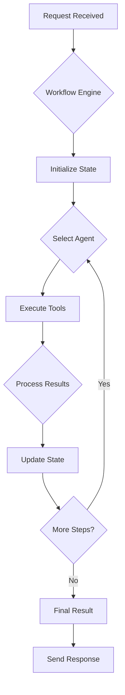

# Thrasio IQ Worker Service

## Project Introduction

The Thrasio IQ Worker Service is an AI-powered backend service designed to handle complex, multi-step tasks. It leverages a powerful combination of language models, task-specific agents, and a robust workflow engine to automate and orchestrate sophisticated processes. This service can be used for a variety of purposes, including data processing, content generation, and automated decision-making.

## Core Features

- **Agent-Based Architecture**: Utilizes specialized agents for different tasks, allowing for modular and extensible functionality.
- **Workflow Orchestration**: Manages complex workflows with multiple steps and dependencies using LangGraph.
- **Extensible Tooling**: Easily integrate new tools and capabilities to expand the service's functionality.
- **Memory Management**: Maintains context and state throughout a task's lifecycle.
- **Scalable and Robust**: Built with FastAPI and Uvicorn for high-performance, asynchronous request handling.

## Core Workflow

The service operates on a defined workflow that processes incoming requests, orchestrates agent actions, and delivers a final result. The core workflow can be visualized as follows:



## Tech Stack

The service is built with a modern Python stack, including:

- **Framework**: FastAPI, Uvicorn
- **AI & ML**: LangChain, LangGraph, Google Vertex AI
- **Data Processing**: Pandas, NumPy
- **Google Cloud**: BigQuery, Storage, Logging
- **Database**: SQLAlchemy
- **Core**: Python 3.11

## Installation and Usage

### Prerequisites

- Python 3.11+
- `uv` package manager

### Installation

1. **Clone the repository:**
   ```bash
   git clone https://github.com/your-repo/thrasio-iq-backend.git
   cd thrasio-iq-backend/services/worker
   ```

2. **Create a virtual environment:**
   ```bash
   python -m venv .venv
   source .venv/bin/activate
   ```

3. **Install dependencies:**
   ```bash
   uv pip install -r requirements.txt
   ```

4. **Set up environment variables:**
   Copy the `.env.example` file to `.env` and fill in the required values.
   ```bash
   cp .env.example .env
   ```

### Running the Service

To start the service, run the following command:

```bash
uvicorn app.main:app --reload
```

## Directory Structure

```
.
├── app/
│   ├── agents/      # Contains specialized agents for different tasks
│   ├── core/        # Core components like configuration and logging
│   ├── memory/      # Manages state and context for workflows
│   ├── processors/  # Data processing and transformation logic
│   ├── prompts/     # Stores prompt templates for language models
│   ├── tools/       # Extensible tools that agents can use
│   ├── utils/       # Utility functions and helper scripts
│   ├── workflows/   # Defines and orchestrates complex task workflows
│   ├── cli.py       # Command-line interface for the application
│   └── __init__.py
├── tests/           # Unit and integration tests
├── .env             # Environment variable definitions
├── .env.example     # Example environment file
├── README.md        # This file
├── requirements.txt # Project dependencies
└── pyproject.toml   # Project metadata and build configuration
```

## Usage Case

This service can be used to automate a variety of tasks. For example, a workflow could be created to:

1.  Fetch data from a BigQuery table.
2.  Process the data using a specialized agent.
3.  Generate a report based on the processed data.
4.  Save the report to a Google Cloud Storage bucket.

This entire process can be triggered by a single API call to the worker service, which will then orchestrate the entire workflow from start to finish.
