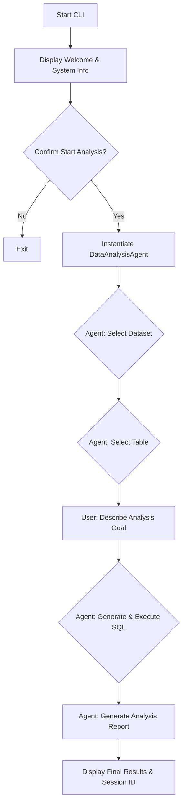

# Thrasio IQ Worker - Data Analysis CLI

## Introduction

This document provides a guide to the Data Analysis Command-Line Interface (CLI), a key component of the Thrasio IQ Worker Service. The CLI offers an interactive, user-friendly way to perform intelligent data analysis on Google BigQuery datasets. It leverages the power of the `DataAnalysisAgent` to understand natural language queries, generate secure SQL, execute queries, and produce insightful reports without requiring users to write any code.

## Core Features

- **Interactive Data Exploration**: Browse available BigQuery datasets and tables directly from the terminal.
- **Natural Language Querying**: Describe your data analysis needs in plain English.
- **AI-Powered SQL Generation**: Automatically translates your requests into efficient and safe (read-only) SQL queries.
- **Automated Reporting**: Generates a final analysis report based on the query results.
- **Two Execution Modes**:
  - **Interactive Mode**: Waits for the entire analysis to complete and shows the final result.
  - **Streaming Mode**: Displays real-time updates and intermediate steps of the analysis workflow.

## Core Workflow

The CLI guides the user through a structured data analysis process from start to finish.



## Tech Stack

The CLI is built upon the same robust foundation as the main worker service:

- **Core Language**: Python 3.11
- **Asynchronous Operations**: `asyncio`
- **AI Agent**: `DataAnalysisAgent` (powered by LangChain/LangGraph)
- **Backend**: Google BigQuery
- **Logging**: `structlog`

## Installation and Usage

### Installation

Installation follows the same process as the main service. Ensure you have activated your Python virtual environment.

1.  **Install dependencies:**
    ```bash
    uv pip install -r requirements.txt
    ```

2.  **Configure environment:**
    Make sure your `.env` file is correctly configured with Google Cloud and LLM settings.

### Usage

The CLI can be run from the root of the `worker` service directory.

**1. Interactive Mode**

This is the default mode. It provides a clean, high-level experience.

```bash
python app/cli.py
```

**2. Streaming Mode**

Use the `--streaming` flag to see real-time progress and each step of the agent's workflow.

```bash
python app/cli.py --streaming
```

## Directory Structure

The CLI is a part of the larger worker service application.

```
.
├── app/
│   ├── agents/      # Contains the DataAnalysisAgent used by the CLI
│   ├── ...
│   ├── cli.py       # The entry point for this CLI application
│   └── ...
├── README.md        # Main project README
└── README_CLI.md    # This file
```

## Usage Case

Here is a typical user session with the CLI:

1.  **Launch the CLI**:
    ```bash
    python app/cli.py
    ```

2.  **Welcome Screen**: The system displays a welcome message, system configuration, and instructions.

3.  **Confirm Start**: The user is prompted to begin.
    ```
    Start data analysis? (y/n): y
    ```

4.  **Dataset Selection**: The agent presents a list of available BigQuery datasets, and the user selects one by number.

5.  **Table Selection**: The agent shows tables within the chosen dataset for the user to select.

6.  **Analysis Goal**: The user describes what they want to find out.
    ```
    Please describe your analysis needs (in natural language):
    > Show me the top 5 products with the highest sales in the last quarter and calculate their total revenue.
    ```

7.  **Automated Processing**: The `DataAnalysisAgent` takes over, generating and executing the necessary SQL queries securely.

8.  **Results**: The CLI prints a confirmation message and the session ID. The generated analysis report is saved for review.
    ```
    ✅ Data analysis completed!

    📊 Analysis report has been generated

    🔑 Session ID: 123e4567-e89b-12d3-a456-426614174000
    ```
